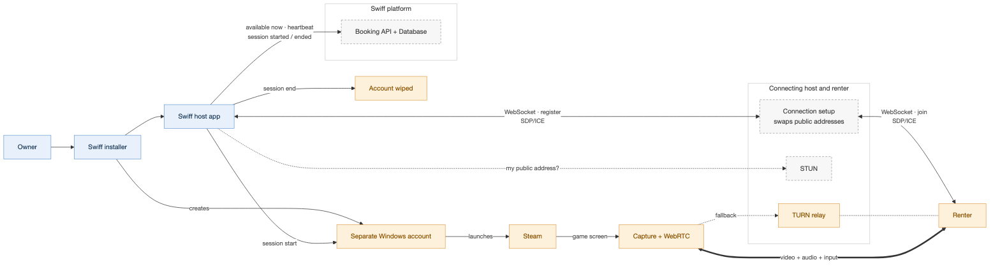
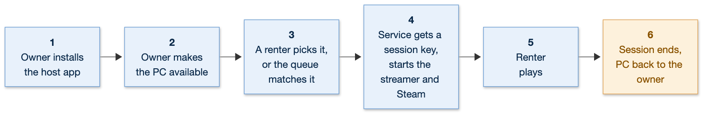

# Swiff host — system design

The gaming PC side of Swiff. An owner installs the host app on their Windows gaming PC;
while a renter plays, the PC runs Steam and the game for them, streams it, and takes their
input. When the session ends, the PC goes back to the owner.

The renter side, and the whole-system architecture: [`renter.md`](renter.md).



- **STUN** tells each side its own public address, the way the outside world sees it.
  The two sides then swap those addresses through **Connection setup**.
- **TURN** relays the stream when no direct path between the two works.

---

## 1. Functional requirements

1. The owner can install the host app on a Windows gaming PC from a single file.
2. The owner can offer the PC for rent, with a price and how long it is available, and
   choose which of its installed games players can stream on it.
3. A running session is protected until its claimed end. The owner's share-until time is
   when new claims stop: a session that started before it runs to its claimed end. The app
   sends it to the platform as `until` on availability, so players can only book time that
   ends by it. The owner can always stop new sessions. Ending early is a
   deliberate, confirmed action: it warns the player and gives them 5 minutes to save, and
   it costs the owner reliability. The app does not offer it yet; it shows this flow only on
   its labelled demo data.
   Powering off or disconnecting the PC is still possible and counts as a drop.
4. The owner can see whether the PC is idle, available or in a session.
5. The renter can play on the PC without anyone sitting at it: Steam and the game start on
   their own.
6. The renter can control the game with mouse, keyboard and gamepad.
7. The owner gets the PC back, unchanged, when the session ends.
8. The renter keeps their game progress: saves from one session are there in the next,
   on any machine.
9. The owner can get the PC ready to host from the app: install Steam with Valve's own
   installer, sign in to their own Steam account in Steam, see which games renters ask for,
   and install any game their account owns (or that is free to play), following its
   progress. Renters always play with their own Steam licence: a game the host installs
   only puts its files on the PC.

---

## 2. Non-functional requirements

|                          | Requirement                                                                                                                                                                                                           | Why                                                                                             |
| ------------------------ | --------------------------------------------------------------------------------------------------------------------------------------------------------------------------------------------------------------------- | ----------------------------------------------------------------------------------------------- |
| **Unattended**           | The system starts capture, Steam and the game with no one clicking anything on the PC.                                                                                                                                | A rental machine has nobody sitting at it.                                                      |
| **Isolation**            | The system runs the session in a separate Windows account and wipes it afterwards.                                                                                                                                    | The renter must never reach the owner's files, passwords or signed-in accounts.                 |
| **Latency**              | The system injects input as OS-level input the moment it arrives.                                                                                                                                                     | Input delay is felt far more than video delay.                                                  |
| **Correctness of input** | The system never leaves a key held down.                                                                                                                                                                              | A dropped key-up walks the character into a wall until the session ends.                        |
| **Liveness**             | The system holds a socket open to the platform, and the platform stops offering the PC the moment it closes.                                                                                                          | Matching a renter to a dead machine wastes their time.                                          |
| **Durability**           | The system uploads the renter's saves before it wipes the session account, and never wipes until the upload succeeds.                                                                                                 | The wipe would otherwise delete the renter's progress.                                          |
| **Control**              | The system keeps a running session going to its claimed end, stops new claims at the owner's share-until time, and ends a session early only on the owner's confirmed action, after a 5-minute warning to the player. | A player who pays must not lose their game mid-session; the owner can always stop new sessions. |
| **Trust**                | The system ships as a signed installer.                                                                                                                                                                               | Screen capture plus input injection looks like malware to antivirus and SmartScreen.            |

---

## 3. Workflow



1. The owner installs the host app, and gets Steam ready in it (below).
2. The owner makes the PC available.
3. A renter picks it, or the queue matches a renter to it.
4. The background service gets a session key and starts the streamer and Steam in the
   separate Windows account.
5. The renter plays.
6. The session ends and the PC goes back to the owner.

Source: [`../diagrams/host-workflow.mmd`](../diagrams/host-workflow.mmd).

### Getting Steam ready

The app reads what Steam leaves on the PC, never the owner's account (`desktop/steam.cjs`):

- **Installed**: the registry's `HKCU\Software\Valve\Steam\SteamPath` holds `steam.exe`.
  Where it does not, the app downloads Valve's installer from the link on
  store.steampowered.com/about, over HTTPS with no redirects, keeps it only when Windows
  confirms Valve signed it, and opens it. The owner clicks through it; nothing is
  installed silently.
- **Signed in**: `HKCU\Software\Valve\Steam\ActiveProcess` holds Steam's `pid` while it
  runs and the signed-in account's id as `ActiveUser`, 0 when nobody is. The owner signs in
  in Steam's own window (`steam://open/main`); the app never asks for a password.
- **Installing**: a game is installed with Steam's `steam://install/<appid>`, from the
  games renters ask for or from a store link or appid the owner pastes; Steam itself
  decides whether the account may install it. Each library's `appmanifest_<appid>.acf`
  without the fully installed bit (4) in `StateFlags` is an install under way: its
  `BytesDownloaded` of `BytesToDownload`, or `BytesStaged` of `BytesToStage` while Steam
  stages or commits it. The app reads these every 2 s while something is under way, every
  8 s otherwise, and reads the PC's games again once an install leaves the list.

---

## 4. Core entities

| Entity              | What it is                                                                        | Key fields                                                                                                            |
| ------------------- | --------------------------------------------------------------------------------- | --------------------------------------------------------------------------------------------------------------------- |
| **Machine**         | This PC, as the platform knows it.                                                | `id`, `owner_id`, `name`, hardware, installed games, `controls`, `price`, `status`, `available_until`, `last_seen_at` |
| **Session**         | One renter playing on this PC.                                                    | `id`, `booking_id`, `machine_id`, `started_at`, `ended_at`, `price`                                                   |
| **Save**            | A renter's save data for one game, kept in object storage (S3).                   | `id`, `renter_id`, `game_id`, `s3_key`, `updated_at`                                                                  |
| **Session account** | The separate Windows account the session runs in. Created at start, wiped at end. | local only, never leaves the PC                                                                                       |

Machine `status`: `idle` → `available` → `reserved` → `in_session` → `available` (or
`idle` when the owner takes it back, `offline` when its socket drops or, with no socket,
it stops sending heartbeats).

---

## 5. API

### Host → platform

Served under `/api` (`server/src/api.ts`). Every call carries the machine key as
`Authorization: Bearer <machine key>`; a session call needs the key of the machine the
session runs on. In Swiff OS the hosting calls bear a host certificate instead
([`session-keys.md`](session-keys.md), Control and hosting credentials).
Availability, heartbeat, upload-test, demand and session start and end
answer any origin (`access-control-allow-origin: *`, preflight included), so the host app
can call them from its `file://` page: the bearer credential is the only one.

```
PUT  /machines/:id/availability
  { available: true, until?, price?, ...report }
  → 200 { id, status, gpu, cpu, price, session? }
  Offer the PC, or take it back (available: false), which ends whatever it was doing.
  `until` is an ISO date; `price` is cents per hour. `report` is below.

POST /machines/:id/heartbeat
  { ...report }
  → 200 { id, status, gpu, cpu, price, session? }
  Carries the parts of the report that changed. Liveness is the PC's socket (below):
  while the socket is open the machine needs no heartbeat. The host app beats every 5 s
  all the same while the PC is offered (`desktop/src/report.ts`), most often with an
  empty body, so it stays live through a socket handover; without a socket or a beat
  for 15 s a machine is `offline`. `offline` means no longer
  offered: its reserved booking goes to another machine, its running session ends. Its
  next heartbeat, or its socket registering again, offers it again. `session.id` names
  the session a renter has claimed; the PC normally hears of it sooner, pushed as
  `session-claimed` (below).

GET  /machines/:id/demand
  → 200 { windowMinutes: 60, games: [{ appid, name, looking, waiting }] }
  What renters ask for, for the owner choosing what to install: per game, busiest first
  and at most 24, the renters who booked it in the last hour or still wait for it
  (`looking`), and its bookings in the queue now (`waiting`). Counts only, never who
  asked. `name` is the catalogue's, null where it has none.

POST /machines/:id/session
  { sessionId }
  → 201 { sessionId, sessionKey, expiresAt }
  Start the host session for the claimed session `sessionId`: its short-lived key is
  what the streamer in the renter's account registers with. → 409 not-claimed when
  `sessionId` is not the session running on this machine. Contract:
  [`session-keys.md`](session-keys.md).

POST /sessions/:id/start
POST /sessions/:id/end
  { endedAt? }
  Mark the session started (the renter arrived), and ended. → 409 once the session is
  over. Any `reason` the host sends is ignored: the server alone decides why a session
  ended, so a host can never claim credit for one: `time_up` once the server sees the
  session within 10 s of its expiry (to absorb clock skew), `host_end` for any earlier
  end the host reports (often a renter who disconnected without leaving; it counts
  neither for nor against completion), `owner_kill` when the owner takes the machine
  back mid-session, `renter` only when the renter leaves with their own ticket
  (renter.md), and from its own deadlines `time_up` or `grace_expired` (the renter never
  arrived) when the join ticket runs out and `host_offline` when the machine goes
  silent or its socket drops. The reason feeds the machine's stability (below).

POST /machines/:id/upload-test
  <up to 8 MB, any bytes>
  → 204
  The upload test: the PC times sending 4 MB here for `net.upMbps`. Nothing is kept.

GET  /sessions/:id/saves
  → 200 { downloadUrl? }
POST /sessions/:id/saves
  → 200 { uploadUrl }
  Short-lived S3 links for this renter's saves for this game. The PC never holds
  storage credentials. Download before the game starts; upload before the wipe.
```

Whenever the platform session ends — the host ends it, the booked time runs out, the
machine goes silent or the owner takes it back — the server also ends the PC's host
session ([`session-keys.md`](session-keys.md)): its session keys die and the streamer is
put out with `session-ended`. The Windows service must treat that denial, or a heartbeat
whose `session.id` has changed or is missing, as the signal to tear down the renter
account session.

### Stability

The server keeps seven days of each machine's history (`server/src/stability.ts`):
how long it was offered and how much of that its socket or heartbeats covered, how often it
dropped offline, how its sessions ended, and the renter's stream quality
(`POST /api/sessions/:id/qos`, authenticated with the session's join ticket:
`{ fps, bitrate, rttMs, packetLoss }`). Session completion counts every session not
ended by `host_offline` or `owner_kill`, out of those not ended early by the host
(`host_end` is left out of completion but still counts as a session and towards the
loss median). `@swiff/rank` buckets that into Steady, OK, Shaky or New.

### Host report

The PC describes itself in the body of its availability and heartbeat calls. Every
section is optional: one that is sent replaces what the platform stored for it, one that
is left out keeps it. The host app sends every section it knows with the first
availability call, then each section again only when it changes: `games` when a game is
installed or removed (it watches the Steam libraries) or the owner offers or stops offering
one, `net` once its figures move, and nothing more on a plain heartbeat. A body is at most
32 KB.

```json
{
  "name": "Nova-01",
  "hardware": {
    "gpu": "NVIDIA GeForce RTX 4070",
    "vramMb": 12288,
    "ramMb": 32768,
    "cpu": "AMD Ryzen 7 7800X3D",
    "cores": 8,
    "encoders": ["h264", "hevc", "av1"],
    "display": { "width": 2560, "height": 1440, "refreshHz": 144 }
  },
  "games": [730, 570],
  "controls": ["kb", "mouse", "pad"],
  "net": { "rttMs": 12, "jitterMs": 2.5, "upMbps": 48 }
}
```

| Field               | Rule                                                                                                                                           | Where the PC gets it                                                   |
| ------------------- | ---------------------------------------------------------------------------------------------------------------------------------------------- | ---------------------------------------------------------------------- |
| `name`              | 1–64 characters, shown to renters                                                                                                              | The owner, in the host app's settings; else the machine id             |
| `hardware`          | All seven fields required                                                                                                                      |                                                                        |
| `hardware.gpu`      | 1–200 characters, the adapter's name as Windows reports it; scored against the GPU score table (`packages/rank`), and an unknown card scores 0 | DXGI adapter description, of the card with the most memory of its own  |
| `hardware.vramMb`   | Whole MB, 0–262144; stored as the whole GB when within 3% of it (8028 → 8192): drivers report under the marketed size; else kept as sent       | DXGI `DedicatedVideoMemory`                                            |
| `hardware.ramMb`    | Whole MB, 0–4194304; snapped to a whole GB in the same way (16311 → 16384), other values kept                                                  | WMI `Win32_PhysicalMemory` capacities, summed                          |
| `hardware.cpu`      | 1–200 characters                                                                                                                               | WMI `Win32_Processor.Name`                                             |
| `hardware.cores`    | Whole number, 1–1024: physical cores                                                                                                           | WMI `Win32_Processor.NumberOfCores`, summed                            |
| `hardware.encoders` | Any of `h264`, `hevc`, `av1`: what the GPU can encode the stream with                                                                          | NVENC, AMF or QSV probe: Media Foundation's hardware encoders          |
| `hardware.display`  | `width`, `height` (1–16384) and `refreshHz` (1–1000), whole numbers: the display the stream captures                                           | The primary display's mode                                             |
| `games`             | Up to 2000 Steam appids, whole numbers from 1: installed, ready to launch and offered by the owner. `[]` means none                            | `libraryfolders.vdf` → `appmanifest_<appid>.acf` with `StateFlags` = 4 |
| `controls`          | Any of `kb`, `mouse`, `pad`; `pad` only when the ViGEmBus driver is installed                                                                  | Driver check                                                           |
| `net`               | All three fields required, numbers from 0: `rttMs` and `jitterMs` up to 60000, `upMbps` up to 100000                                           | Round trip to the server, and an upload test (below)                   |

The host app reads the hardware once per launch, in one PowerShell run (`desktop/probe.cjs`);
the section is sent only once all seven fields are read. `rttMs` is the median round trip
of the signaling socket's latest pings (one a second for the first three, then every 25 s;
the server answers them from memory) and `jitterMs` their mean change from one to the next;
`upMbps` is timed from an upload test when the PC goes live and every 30 minutes after,
never while a player is on.

A claim for a game the owner does not offer (the owner stopped offering it as the claim
came in) is turned down: the app ends that session at once (`POST /sessions/:id/end`)
instead of serving it, and until the platform confirms that end it offers the screen to no
renter who joins. An end that fails on the network or the server is tried again, from 5 s
apart up to a minute, for as long as the app runs.

A bad field is a `400` naming it; nothing in that body is stored. The matcher gives a
booking only to a machine that lists the game in `games` and meets the game's minimum
GPU score, RAM and VRAM, so a PC that has not sent `hardware` and `games` is never
matched. Renters' lists of machines (renter.md, "What can be played where") estimate
each PC's latency from `net.rttMs`, so a PC that has not sent `net` is not listed.

### Connection setup (WebSocket)

| Message                    | Direction   | Meaning                                                                                                                                   |
| -------------------------- | ----------- | ----------------------------------------------------------------------------------------------------------------------------------------- |
| `register`                 | PC → server | Open the room and wait for the renter. Carries the machine key (a host certificate in Swiff OS, [`session-keys.md`](session-keys.md)).    |
| `session-claimed`          | server → PC | A renter claimed this PC: `{ sessionId, appid, minutes }`. The service starts the host session for that `sessionId` at once.              |
| `denied`                   | server → PC | The machine key was refused. The app stops sharing and does not retry, except on `session-active` ([`session-keys.md`](session-keys.md)). |
| `join`                     | server → PC | The renter has arrived; the PC creates the offer.                                                                                         |
| `offer` / `answer` / `ice` | either way  | Relayed to the renter untouched.                                                                                                          |
| `ping`                     | every 25 s  | Keeps the socket alive.                                                                                                                   |

The open socket is the PC's presence. The machine stays offered for as long as it is
open, and goes `offline` the moment the service's socket closes while the PC is on offer
(`available` or `reserved`); a socket that stops answering `ping` is closed by the server
after two missed rounds. The PC drops and reopens a socket that has heard nothing back for two
rounds in the same way, so a half-open socket does not leave it waiting. Once a renter has claimed the PC the room is being handed to the
streamer, so a socket that closes from then on (the service's or the streamer's) leaves
the machine the 15 s heartbeat window to come back on its new credential: a renter's
session does not end with one socket.

Presence itself lives in the server's memory, so once per 25 s round the server stores,
in one write, that each PC whose socket pinged since the last round was there then. After
a crash or restart a PC that never comes back is taken offline as of that last stored
round, and a session it was running ends, priced for the time played, at that moment.

The machine key comes from `npm run machine-key -- <machine-id> <owner-steam-id>`, which
also records the owner, so the owner is never matched to their own PC. The host app keeps it
encrypted with Electron `safeStorage` (Windows DPAPI), and the renderer can only reach it
through two calls in `desktop/preload.cjs`. The server stores only its hash. See "Room
access" in [`renter.md`](renter.md).

During a renter's session the machine key stays with a background service outside the
renter's Windows account; the streamer registers with a short-lived session key instead.
The contract for the Windows side is in [`session-keys.md`](session-keys.md).
