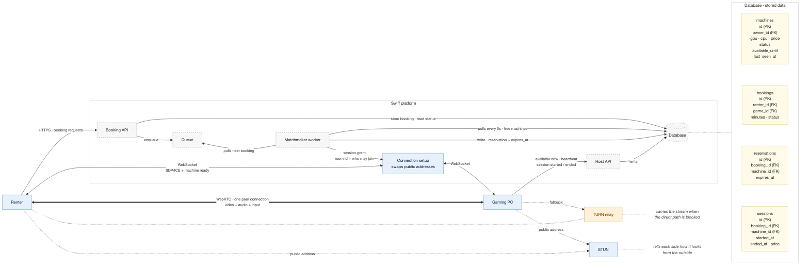
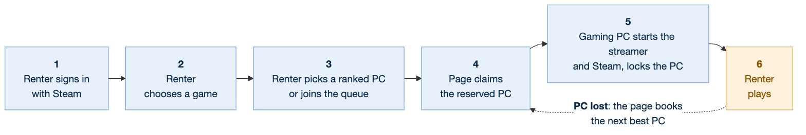

# Swiff renter — system design

Rent an idle gaming PC and play it in a browser.

Owners run a small host app on their Windows gaming PC. Renters pick a game on the web,
get matched to a free machine, and play it over a direct WebRTC stream.

The gaming PC side: [`host.md`](host.md).



Source: [`../diagrams/system-architecture.mmd`](../diagrams/system-architecture.mmd).

---

## 1. Functional requirements

1. The renter can browse the games that can be played.
2. The renter can sign in with Steam. Starting a session requires it; signed-out visitors
   can only browse and never see machine availability.
3. The renter can book a game for a number of minutes, when it is in their own Steam
   library or free to play: the renter always plays with their own Steam licence, and a
   host's copy only means the files are installed (`server/src/licence.ts`).
4. The renter is matched to a free gaming PC that can run the game. The renter's own PC is
   never listed, recommended or matched (gate E5 in `packages/rank`).
5. The renter can play the game in the browser on the remote gaming PC, with Steam
   already started for them.
6. The renter can end the session and is charged for the time played.
7. The renter keeps their game progress between sessions, on any machine.
8. The owner can offer a PC for rent, with its hardware, price and how long it is available.
9. A running session is protected: it runs to its claimed end unless the owner deliberately
   confirms ending it early. Ending early gives the renter 5 minutes to save and costs the
   owner reliability; the host app shows this flow only on its labelled demo data (see
   [`host.md`](host.md), requirement 3).
10. A signed-in player founds a crew in one tap and shares its link, to WhatsApp first;
    anyone in the crew may share it. Nobody is asked about a PC to found or join: anyone
    in the crew brings a gaming PC now or later, a crew may have several, and a PC owner
    picks per crew which crews their PC plays for. A PC that plays for crews is offered
    and matched to the people in them and nobody else (gate E7, "Crews" below).
11. A crewmate can watch a player play, and talk with them: they see who in their crew is
    playing and ask to watch, the player says yes or no over their game, and on yes the
    crewmate gets the game's picture and sound, view only. The player sees who watches and
    stops anyone at any time, can share with the whole crew at once, and everyone watching
    can talk in a voice chat. Watching books nothing ("Watching a crewmate play" below).

**Out of scope for now:** payments, owner onboarding, anti-cheat titles, running more than
one session per machine.

---

## 2. Non-functional requirements

|                  | Requirement                                                                                                                  | Why                                                                                             |
| ---------------- | ---------------------------------------------------------------------------------------------------------------------------- | ----------------------------------------------------------------------------------------------- |
| **Latency**      | The system keeps input-to-picture as low as the network allows, and keeps video off Swiff servers unless it has to relay it. | It is a game, not a video. Every hop is felt.                                                   |
| **Quality**      | The system streams 1080p at 60 fps, ~10 Mbit/s, and holds resolution under load.                                             | What a gaming PC is being rented for.                                                           |
| **Connectivity** | The system connects from any home or mobile network.                                                                         | ~1 in 5 connections cannot hold a direct path (symmetric NAT, carrier CGNAT); TURN covers them. |
| **Consistency**  | The system gives a machine to **at most one** booking at a time.                                                             | Two renters on one PC is the worst failure the product can have.                                |
| **Availability** | The system stops offering a PC that goes offline within seconds.                                                             | Matching a renter to a dead machine wastes their time.                                          |
| **Isolation**    | The system keeps the renter away from the owner's files and account.                                                         | Owners hand their PC to strangers. See `../diagrams/host-isolation.png`.                        |
| **Cost**         | The system relays traffic only for the minority of sessions that need it.                                                    | A relayed hour is ~4.5 GB.                                                                      |

---

## 3. Workflow



1. The renter signs in with Steam.
2. The renter chooses a game.
3. The renter picks one of the ranked available PCs, or joins the queue when none fits;
   matching only serves the queue.
4. The page claims the reserved PC (booking `claimed`).
5. The gaming PC starts the streamer and Steam in the separate Windows account and locks
   the PC.
6. The page joins the PC's room and plays its stream; on the first frame it starts the
   session (booking `playing`) and the PC launches the game.
7. The renter plays, and ends the session with End. A renter whose connection drops
   comes back to the same PC within 2 minutes; see "Coming back" below. A PC lost
   mid-session (gone offline, or taken back by its owner) is replaced by the next best
   PC with nothing to press: back to step 4 there; see "Machine lost" below.

Step 4 needs no click: the page claims a picked PC the moment it is booked, and a queued
booking the moment it hears of the match, over its event stream or its fallback poll.
Steps 4 to 6 are Ignition on the page; see "Playing" below.

Source: [`../diagrams/workflow.mmd`](../diagrams/workflow.mmd).

---

## 4. Core entities

| Entity          | What it is                                                      | Key fields                                                                                                                                            |
| --------------- | --------------------------------------------------------------- | ----------------------------------------------------------------------------------------------------------------------------------------------------- |
| **Machine**     | A gaming PC offered for rent.                                   | `id`, `owner_id`, `name`, hardware, installed games, `controls`, `price`, `status`, `available_until`, `last_seen_at`                                 |
| **Booking**     | A renter's request to play a game for N minutes.                | `id`, `renter_id`, `game_id`, `minutes`, `status`, `last_seen_at`                                                                                     |
| **Reservation** | A machine held for one booking, for a limited time.             | `id`, `booking_id`, `machine_id`, `matched_at`, `expires_at`                                                                                          |
| **Session**     | Time actually played on a machine. What gets charged.           | `id`, `booking_id`, `machine_id`, `started_at`, `ended_at`, `end_reason`, `price`, `ticket_id`, `qos`                                                 |
| **Save**        | A renter's save data for one game, kept in object storage (S3). | `id`, `renter_id`, `game_id`, `s3_key`, `updated_at`                                                                                                  |
| **User**        | A renter or owner, identified by their Steam account.           | `id`, `steam_id`                                                                                                                                      |
| **Game**        | Something in the catalogue. Comes from Steam.                   | `id` (Steam app id), `name`                                                                                                                           |
| **Crew**        | A group of friends who play on each other's gaming PCs.         | `id`, `owner_id` (admin), `owner_name`, `name`, `ready_at`, `archived_at`; members `id`, `crew_id`, `user_id`, `name`, `invite_id`, `joined_at`, `pc` |
| **Invite**      | A crew's link, which anyone in it may share.                    | `id`, `crew_id`, `inviter_id`, `created_at`, `revoked_at`                                                                                             |
| **Crew PC**     | A PC its owner picked to play for a crew.                       | `crew_id`, `machine_id`, `added_by`, `added_at`                                                                                                       |

Booking `status`: `queued` → `matched` → `claimed` → `playing` → `ended`. A booking
becomes `expired` when its reservation lapses unclaimed, or when it is queued and the
renter has not checked on it for 2 minutes. Opening the event stream on the booking
(below) and the page's heartbeat while it is open count as checking on it; a stream
merely left open does not.

Machines, bookings, reservations and sessions are one Postgres table each
(`server/src/platform.ts`), in the database at `DATABASE_URL` (Neon in production). The
server makes the tables on start, through the migrations in `server/src/schema.ts`, and
keeps nothing in local files, so a host that sleeps and loses its disk loses no data.
Unset, the data lives in memory (PGlite, Postgres compiled to WebAssembly) and resets
with the server, so dev and the e2e tests need no database server. Platform calls take
turns, each one transaction; one that may write first locks the machines table, so a
second server on the same database cannot interleave with it either. Crews, their
members and invites are tables of their own beside them. Users, games and
saves have no table yet: a user is their Steam id (a booking's `renter_id`, a machine's
`owner_id`), games come from Steam, and saves are not built.

---

## 5. API

All requests are HTTPS, served under `/api` (`server/src/api.ts`). The `/me`,
`/availability`, `/games/:appid/machines`, `/bookings`, `/events`, `/crews`,
`/invites/:token/join` and `/crew-members` calls carry the renter's sign-in session and answer `401` without one;
`GET /games`, `GET /ping`, `POST /signout` and `GET /invites/:token` work signed out, and
the `/sessions` calls carry the join ticket instead.

### Sign-in session

Sign-in is Steam OpenID (`server/src/steam.ts`): `/auth/steam/login` sends the browser to
Steam, and `/auth/steam/return` checks Steam's answer with Steam itself. When Steam vouches
for the player, the server signs them in with a cookie (`server/src/signin.ts`) and sends
them back to the page they came from, flagged `#steam=ok` (or `#steam=denied`). Nothing
about the player rides in the URL.

Steam's answer only counts when it is from Steam's own endpoint and was made for this
site's `/auth/steam/return`. "This site" is `PUBLIC_ORIGIN`, never the request's `Host` or
`X-Forwarded-*` headers, which the client controls; the same origin decides the cookie's
`Secure` flag and where the browser lands afterwards. Unset, it defaults to
`http://localhost:<PORT>` outside production; with `NODE_ENV=production` and no
`PUBLIC_ORIGIN`, every sign-in is refused (`#steam=denied`, no cookie) and the server warns.

Steam's answer also only counts in the browser that asked for it. `/auth/steam/login` sets
a short-lived sign-in cookie holding a random nonce and puts the same nonce in the
`return_to` Steam signs; the return is refused before Steam is asked unless that cookie
comes back with the matching nonce, and the cookie is cleared either way. Without it, a
return URL someone made with their own Steam account could sign another person's browser
in as them (login CSRF), and that person's bookings would land on their account.

Deployment: set both `SESSION_SECRET` (below) and `PUBLIC_ORIGIN` (the site's public
origin, e.g. `https://swiff.example`) in the server's environment.

| Cookie          | Holds                                                                                     | Attributes                                                                    |
| --------------- | ----------------------------------------------------------------------------------------- | ----------------------------------------------------------------------------- |
| `swiff_session` | The renter's Steam id and an expiry (7 days), signed with `SESSION_SECRET` (HMAC-SHA256). | `HttpOnly`, `SameSite=Lax`, `Path=/`; `Secure` whenever the site is on https. |
| `swiff_signin`  | One sign-in attempt's nonce and an expiry (10 minutes), signed with `SESSION_SECRET`.     | `HttpOnly`, `SameSite=Lax`, `Path=/auth/steam`; `Secure` on https.            |

- **`SESSION_SECRET` is its own secret,** at least 32 characters and never `ROOM_SECRET`,
  so a leak of one forges neither the other's tickets nor sessions. Without it nobody can
  sign in, and so nobody can book.
- **The server keeps no session state.** Signing out clears the browser's cookie; a copy
  of the cookie taken before then stays valid until it expires. `HttpOnly` keeps it out of
  reach of scripts on the page, and `SameSite=Lax` keeps it off another site's POSTs, so
  another site cannot book or claim as the renter.
- **The page asks the server who is signed in** (`GET /me`), on every load, so a signed-in
  renter stays signed in across reloads until the cookie expires or they sign out.
- **Signing out only counts once the server says so.** If `POST /signout` fails, the cookie
  is still valid, so the page says sign-out failed and keeps the renter signed in rather
  than showing a signed-out wall that the next load would undo.

### Booking API

```
GET  /games
  → 200 [{ id, name, image }]
  List the games that can be booked: only games Swiff can run (`server/src/playable.ts`),
  as every list of games a renter is sent. Works signed out.

GET  /ping
  → 204
  Answers at once. The page times it to measure its round trip to the server, which the
  two reads below take as `rtt`. Works signed out.

GET  /availability?appids=730,570&rtt=&controls=&picture=&minutes=
  → 200 [{ appid, free, ready, best, busy, backAt, backName }]
  For each game asked about that Swiff can run (1 to 100 appids, in the order asked,
  repeats once; one it cannot run is left out), how
  many machines the renter could play it on right now (`free`), how many of those are
  free for all of the optional `minutes` (1 to 720; `ready`, which is `free` without
  `minutes`), the best of those as the game page would rank it first (`best`, `{ id,
  name, gpu, latency, availableUntil }`, or null), how many would fit but are taken
  (`busy`), and the soonest a taken one is free again (`backAt`, Unix ms, or null) and
  its name (`backName`). `minutes` never changes `free` or `busy`. Same rules as the
  list below, so the wall and the game page agree.
  → 400 for a missing, malformed or too long `appids`, a missing or bad `rtt`, a bad
  `controls`, `picture` or `minutes`. → 429 past the renter's budget of these reads
  (below).

GET  /games/:appid/machines?minutes=60&rtt=&controls=&picture=
  → 200 { appid, minutes, requirements, machines, reason, busy }
  The machines the renter could play one game on for `minutes` (1 to 720), best
  first. Each is `{ id, name, gpu, vramMb, ramMb, cpu, cores, encoders, refreshHz,
  controls, price, availableUntil, minutesLeft, coversSession, latency, response,
  picture, stability, headroom }`, where `latency` is `{ rttMs, jitterMs, source:
  "estimate" }` and the scores are `@swiff/rank`'s. `requirements` is what the game was
  judged against and its `source` (curated, steam or default); `reason` is the rule
  that put the first above the second (`{ rule, label }`, null with fewer than two);
  `busy` lists the taken machines that would fit, `{ id, name, backAt }`, soonest
  first. → 400 for a bad appid or `minutes`, a missing or bad `rtt`, or a bad
  `controls` or `picture`. → 404 { error, code: "not-playable" } for a game Swiff
  cannot run. → 429 past the renter's budget of these reads (below).

GET  /me
  → 200 { steamId, profile }
  Who is signed in, and their Steam profile (persona, avatar, library), read from Steam.
  The full list of owned appids stays on the server, for the licence check on
  `POST /bookings` and its claim; the page gets the capped library only, holding only
  the games Swiff can run, and `profile.checking`, how many of the games it could still
  show have no verdict yet; the page asks again while that is above 0. Reading it puts
  the renter's library first in line to be checked for that.
  A profile read is kept in memory for 5 minutes per renter, so reloads do not spend the
  Web API quota; a read Steam fails or takes over 3 s to answer is not kept. For 10 s
  after a failed read Steam is not asked again for that renter: they get their last
  good profile, or an empty one when there is none.
  → 401 when nobody is.

POST /me/refresh
  → 200 { steamId, profile }
  As `GET /me`, but read from Steam again rather than the kept copy, e.g. after the
  renter makes their game details public. A read under 10 s old, or a failed read under
  10 s ago, is not repeated, so retries cost at most one Steam read per 10 s.
  → 401 when nobody is signed in.

POST /signout
  → 204
  Clear the sign-in cookie. Works signed out.

POST /bookings
  { gameId, minutes, machineId?, rtts?, controls?, picture? }
  → 202 { bookingId, status, machine?, claimBy? }
  Request a game for N minutes (at most 720), as the signed-in renter. `rtts` are the
  renter's round trips in ms as the page measured them: `server`, to this server, and
  `machines`, straight to each machine it probed (at most 50), by id; matching judges each
  machine's latency by them (see "Matching"). Each may be left out. `controls` and
  `picture` are how the renter plays, as `/games/:appid/machines` takes them (a list of
  kb, mouse, pad; best, 4k or 120fps; none and best when left out), → 400 otherwise;
  matching, the picked machine's gates and `nextBest` all rank by them.
  Without `machineId` the booking joins the queue: matching happens in the background,
  and `status` is "matched" already when a machine was free.
  With `machineId`, the machine the renter picked from their list, it is reserved for
  them at once when it is still free for the whole booking and passes the same gates
  matching does: `status` is "matched", to be claimed by `claimBy`, 60 s from now.
  → 409 { error, nextBest } when the picked machine was taken since the list was read (or
  is gone, or is not one they could have), and no booking is made. `nextBest` is the
  machine their list would now put first, ranked by their `rtts.server`, `controls` and
  `picture`, free for the whole booking, in the same shape
  as `/games/:appid/machines` lists it, or null when there is none. Working it out spends
  one of the renter's discovery reads (below); past their budget it is null.
  → 403 { error, code } when the game is neither in the renter's Steam library nor free
  to play (`code` "not-owned"), or their library cannot be read (game details private,
  no `STEAM_API_KEY`, Steam down) and the game is not free to play
  ("library-unreadable"); no booking is made. Free to play is Steam's store data, or the
  wall's curated free-to-play titles when the store does not answer within 3 s.
  → 403 { error, code: "not-playable" } when Swiff cannot run the game, or has no fresh
  verdict on it yet (`server/src/playable.ts`); no booking is made.

GET  /bookings/:id
  → 200 { bookingId, status, machine?, claimBy?, startedAt?, price?, heldUntil?, endReason? }
  Check whether a machine has been found yet. `machine` names it too (`name`, the one
  its owner gave it). `claimBy` is when the reservation lapses; `startedAt` (Unix ms) is
  when a running session started, so a page coming back to it keeps its clock; `price`
  (cents) is set once the session has ended. `heldUntil` (Unix ms) is set on a claimed or playing
  booking whose renter dropped out of the room: until then the PC holds the session
  for them (see "Coming back"). `endReason` is set once the session has ended, as the
  session records it (`renter`, `time_up`, `host_offline`, `owner_kill`,
  `grace_expired`); `host_offline` and `owner_kill` mean the machine was lost (see
  "Machine lost"). Checking also keeps a
  queued booking in the queue: one nobody has checked on for 2 minutes expires.
  → 404 for an unknown booking, and for one another renter made: a renter only ever
  sees their own.
  The page uses this only while its event stream is down.

POST /bookings/:id/seen
  → 204
  The page's heartbeat while its event stream is open (every 15 s): counts as checking
  on the booking, the same as GET /bookings/:id, without the body. → 404 for an
  unknown booking or another renter's.

GET  /events
  → 200 text/event-stream
  The wall's stream (`server/src/events.ts`), for the signed-in renter: `event:
  availability` with `{}` as its data each time a machine is offered, taken back, taken by
  a booking, freed or goes offline. What changed differs per renter (their own PC, how
  far away each machine is), so the event carries nothing and the page reads
  `/availability` (and the open game's `/games/:appid/machines`) again, within its
  budget. Keep-alives, the session's end and the stream caps are as below; this stream
  counts against the renter's and the server's caps like a booking stream.
  → 401 signed out. → 429 past a stream cap.

GET  /events?booking=:id
  → 200 text/event-stream
  The renter's event stream (Server-Sent Events, `server/src/events.ts`), for the
  signed-in renter's own booking. Sends the booking at once, then again the moment its
  status changes, as `event: booking` with the same body as GET /bookings/:id; `claimBy`
  is the claim countdown. A `: keep-alive` comment every 25 s keeps an idle stream open
  through Cloudflare. Opening the stream counts as checking on the booking; from then on
  only the page's heartbeat keeps a queued booking in the queue, since a sleeping laptop's
  stream can stay open long after its page stopped running. A renter whose stream is open
  at the match is there for it: their 60 s to claim run from the match. The stream ends once the booking is claimed, playing,
  ended or expired, after sending that status, and when the renter's sign-in session
  runs out; the page then treats the booking as gone from view, as it does a 401 on its
  heartbeat or poll. Opened with `&to=end`, it follows a claimed or playing booking on
  until it is ended or expired instead: how the page playing a session hears at once that
  its machine was lost. A booking takes at most 3 streams at a time, a signed-in renter 10
  and the server 500 (`MAX_EVENT_STREAMS_PER_RENTER`, `MAX_EVENT_STREAMS`); more are
  refused with 429. A stream the renter does not read fast enough is dropped (EventSource
  reconnects it). → 404 for an unknown booking or another renter's, even while a stream
  cap is full.

POST /bookings/:id/claim
  → 200 { sessionId, roomId, signalingUrl, ticket, rentalMode }
  Take the matched machine before the reservation expires (`claimBy`). Returns the room to
  join and the join ticket that opens it (see "Room access" below), valid for the
  booked minutes or until the session ends, whichever comes first. On a rental-mode PC
  the booked minutes run from the session's start rather than the claim: the renter
  signs in to Steam in between, within 10 minutes of the claim however often they try
  again (`STEAM_SIGN_IN_MS` in `@swiff/rank`), or the session ends unstarted as
  `grace_expired`. Once the PC relays `steam-login signed-in`, what is left of those
  10 minutes gives way, once, to 3 minutes for the game's first frame
  (`STEAM_LAUNCH_GRACE_MS`), still without starting the booked minutes, so an approval
  just in time still gets its game. The first frame is thus due at most 13 minutes
  after the claim, sooner when the renter approves early. Its ticket is minted for that
  longest case plus the booked minutes, and a rental-mode PC counts as free for a
  session (matching, `ready`, `coversSession`, `backAt`, the page's fit check) only for
  all of them.
  → 409 if the booking is not matched (its reservation lapsed, or it has expired), or
  is matched to the renter's own machine (the booking goes back to the queue).
  → 403 { error, code } as `POST /bookings`, checked again since the library, or whether
  Swiff can run the game, may have changed; the reservation is left unspent.
  → 503 when Steam does not give the renter's library and the game is not free to play:
  the reservation is left unspent, and the page tries the claim again.
  → 404 for a booking another renter made.

POST /bookings/:id/rejoin
  → 200 { sessionId, roomId, signalingUrl, ticket, rentalMode, signInMs? }
  Come back to the booking's running session (claimed or playing), for a page that no
  longer holds its ticket: the page never stores it (see "Playing" below). The ticket
  carries the id recorded at claim, the same seat, so joining with it takes the seat
  back, from a socket of the renter's that still hangs on too, rather than being
  refused as `room-taken`, and ending the session revokes it with the first. It is valid
  only until the session's deadline. On a rental-mode PC whose session has not started,
  `signInMs` is what is left of the claim's Steam sign-in time, until the renter has
  approved it; after that it is left out. Changes nothing on the server: the session, its
  clock and its machine stay as they are; see "Coming back".
  → 409 { error, status } when the booking has no session running: not yet claimed,
  over, or past its deadline.
  → 503 when ROOM_SECRET is not set.
  → 404 for an unknown booking or another renter's.

POST /bookings/:id/end
  → 200 { bookingId, status: "ended", sessionId?, price? }
  The renter ends their booking, whatever it has come to: a queued one leaves the queue,
  a matched one hands its machine back to whoever waits next, and a claimed or playing
  one ends its session as `renter`, as leaving with the ticket does: the ticket is
  revoked, the PC's host session ends and the time played is priced.
  → 409 { error, status } once the booking is over (ended or expired).
  → 404 for an unknown booking or another renter's.

POST /bookings/:id/continue
  → 202 { bookingId, status, machine?, claimBy?, ... }
  Carry on a session whose machine was lost (`endReason` `host_offline` or
  `owner_kill`, within the last 10 minutes) on another machine: a new booking for the
  same game and the whole minutes the renter had left, asked with the `rtts`, `controls`
  and `picture` the lost booking was, and never matched to the machine that lost it. It
  takes the lost booking's place in the queue, ahead of bookings made after it, and is
  matched at once to the machine rank() puts first among those free for it (`status`
  "matched", to be claimed by `claimBy`, 60 s from now), or waits in the queue. Asked
  again while that booking is not over, it is answered with the same one. → 409 { error,
  status } when there is nothing to carry on (the session is still running, ended any
  other way, was lost more than 10 minutes ago, or had less than a minute left).
  → 403 { error, code } and 503 as `POST /bookings/:id/claim`, checked again since the
  library may have changed; nothing is booked. → 404 for an unknown booking or another
  renter's.

POST /sessions/:id/start
  → 200 { sessionId, roomId }
  The renter's first frame arrived: starts the session, with the join ticket as bearer,
  if it has not started yet (booking `playing`; the time played is counted from here),
  and tells the PC serving it to launch the game booked (`launch-game`, below). Sent
  again on each new connection's first frame, which tells the PC again. The PC's own
  start (host.md) takes the machine key instead. → 403 for another session's ticket,
  → 409 once the session is over or past its deadline (even before the timer that ends
  it has run, so no `launch-game` goes out for it), and → 409 for a rental-mode session
  whose Steam sign-in the PC has not yet reported approved (`steam-login` `signed-in`).

POST /sessions/:id/qos
  { fps, bitrate, rttMs, packetLoss }
  Report stream quality during the session, with the join ticket as bearer, and once
  more up to 60 s after it ends while the ticket is still valid. Feeds the machine's
  stability; see host.md, "Stability". Later concern: each report counts equally in the
  session's running mean, so a policy for duplicate or uneven sampling (bounded report
  intervals, report ids, and telling sparse from absent telemetry) is still to come.

POST /sessions/:id/leave
  The renter is leaving: ends the session as `renter`, with the join ticket as bearer.
  → 403 for another session's ticket, → 409 once the session is over. With
  POST /bookings/:id/end, the only ways a session is recorded as the renter's own choice
  to end it, and the only ways it ends at once. A renter who just closes the page, or
  whose connection drops, has the reconnect grace to come back (see "Coming back"); one
  who does not is recorded as `grace_expired`, priced only up to the drop and counted
  neither for nor against the machine's completion. One who ends it while that grace
  runs is still recorded as `renter`, but priced only up to the drop.
```

### What can be played where

`/availability` and `/games/:appid/machines` (`server/src/candidates.ts`) run
`@swiff/rank`'s `rank()` over every machine on offer that is answering, for the
signed-in renter: gates E1–E7, then the fixed sort, with the game's requirements from
the requirements table. Both are signed in only: working them out for every visitor
would cost too much, so signed-out visitors see no availability (requirement 2). The
renter's own machine is never counted or listed (E5), nor a crew-only one that plays for
none of their crews (E7, not even as coming back), nor one whose offer has run
out (its `available_until` has passed). Query parameters say how the renter plays:
`rtt`, their round trip to the server in ms as the page measured it (required, 0 to
10000), and, optionally, `controls`, a comma-separated list of `kb`, `mouse`, `pad`
the machine must take (E4), and `picture`, `best` (default), `4k` or `120fps` (the
sort's O3).

Latency is estimated through the server for every machine: the renter's `rtt` plus the
PC's own round trip to the server from its host report (`net.rttMs`), with the PC's
jitter. The direct path is usually shorter, so the estimate is an upper bound, and it
cannot tell a direct path from a relayed one. A machine more than 80 ms away by the
estimate (E6), or one that has never reported `net`, is not listed. No PC's address is
stored or sent: a renter sees a machine's id, name, hardware, terms and scores, never
its owner. Probing the top few machines directly is a later step.

A busy machine (reserved or in session) is free again when its session runs out, or,
while reserved, when a claim at the last moment would run out; one taken until after its
owner wants it back is not counted as coming back, and the game page lists a busy machine
only when, once back, its offer still has the `minutes` asked for.

The wall (`web/src/swiff/useLive.ts`) reads `/availability` for its games once the page
has timed `/ping`, and the open game's `/games/:appid/machines`, then reads both again on
each `availability` event, at most once every 3 s. While the stream is down it reads every
30 s instead, and every 2 min regardless, since an offer that simply runs out sends no
event. A game that goes from nothing ready to something ready pulses on the wall, with a
chime for a renter who turned interface sounds on. The five invented machines and the
evening pinned to 20:00 the wall was designed on are only at `/?demo=1` and in the tests.

Each read ranks every machine on offer, so one signed-in renter cannot hog the server
with them: each has a budget of 20 of these reads at once, then one more every 2 s (30
a minute), counted across both calls and keyed on their Steam id
(`server/src/budget.ts`). Past it the answer is `429` with `Retry-After` in seconds.
At most 100,000 renters are tracked at once; past that, those whose budget is full again
and then the least recently active are forgotten, and start again from a full budget.

### Matching

Matching runs in the server process on every change, with one timer armed for the next
deadline (a reservation lapsing, a machine's liveness, a queued booking timing out, a
session running out) instead of a sweep: the oldest queued booking gets the machine
`@swiff/rank`'s `rank()` puts first for it, among the live machines free for all of its
minutes (and a rental-mode PC's Steam sign-in before them), and the machine is reserved for it. That is the order of the renter's own list
(see "What can be played where"), not merely the cheapest: a machine must have the game
installed and meet the game's minimum hardware (gates E2 and E3), take every control the
renter turned on (E4), not be the renter's own (E5), be within 80 ms of the renter
(E6) and, when it is crew-only, play for a crew they are in (E7), and the best of those is the one free all session, then not Shaky, then with the
best response, then picture, then the lowest latency, then the lowest price. The controls
and Picture setting are the ones the booking was made with; a booking made without them
asks for no controls and the best picture.
Latency is judged by the round trips the booking was made with: one the renter measured
straight to a machine, else the estimate through the server (their `rtts.server` plus
the PC's own round trip); a booking with no round trips counts the renter's leg as
nothing. A machine that never reported its network is never matched. A booking for a
picked machine skips the queue only for that machine, and only while it is free: a
waiting booking it fits is matched to it first. A machine's owner is the
Steam id on its `MACHINE_KEYS` entry, recorded on the machine each time it checks in; a
machine whose entry names no owner can be matched to anyone, and the server warns about
it at startup. A newly configured owner counts at once: a reservation they already hold
on their own machine goes back to the queue, and `claim` refuses it. A matched renter has
60 s to claim, counted from their first check on the booking since the match: the match
itself when they were there for it, which is when their event stream on the booking is
open at the match, whoever made it, or the match was made in their own call (a picked
machine, or a booking matched as it was made or checked on). A renter away at the match
(stream closed: tab closed, laptop asleep) has the
machine held for them, and their 60 s start when their page speaks again (the event
stream reopening, a check or a heartbeat), but no reservation outlasts 2 minutes from
the match, so a renter who never comes back holds a machine for 2 minutes at most.
`claimBy` is the deadline as it stands: until the renter is back, the end of those 2
minutes. When a reservation lapses unclaimed the booking expires and the machine goes
to the next in line. A machine that goes silent hands its reserved booking back to the
queue.

A queued booking expires 2 minutes after the renter last checked on it, so a renter who
closed the tab does not hold a machine when one frees up. Until then the server keeps it
resumable: a renter who comes back within those 2 minutes (browser reopened, laptop woke
up) and checks on the same booking id keeps their place. The web helper
`web/src/swiff/booking.ts` stores the booking id in `localStorage` when it books and, on
page load, resumes watching the stored booking over the event stream, forgetting it once
the booking is claimed, ended or expired. While the stream is open it sends the heartbeat
POST /bookings/:id/seen every 15 s. `EventSource` reconnects a dropped stream by itself;
until it does, the helper checks on the booking with a slow poll (every 5 s) instead.

The page claims by itself (`followBooking` in the same helper, wired into the game page
by `web/src/swiff/useSwiff.ts`): a picked machine right after its 202, with no click, and
a queued booking the moment the match arrives, with a chime when the tab is out of sight.
An open page is the renter being there, so the match is claimed whether the event stream
pushes it or the slow poll that stands in while the stream is down finds it. A claim of
that match lost to the network is tried again, waiting longer each time, until the
reservation lapses (`claimBy`); one the server refuses is left. A lost claim that went
through after all (a later try refused as `claimed`, or the stream reporting it claimed)
holds the machine with no ticket to join it, so the page ends that booking and the machine
goes back. While the
page is closed they are away, and nothing is claimed until they come back: a machine
matched meanwhile is held for them up to 2 minutes from the match, and their 60 s to
claim it start when the page reopens its stream. The page books the server's
own machines, from the ranked list it reads, and sends its round trip to the server (as
timed against GET /ping) as `rtts.server`, with the renter's controls and Picture setting,
whether it books a picked machine or queues. A picked machine taken first is answered with
the next best from that list, which the page offers to launch on instead; with nothing
free on the list the page offers the queue. The demo (`/?demo=1`) books nothing: its
machines are invented. Leaving the queue, cancelling a launch and ending
a session all end the booking (POST /bookings/:id/end).

### Crews

A crew is a group of friends who play on each other's gaming PCs (`server/src/platform.ts`,
crews). A signed-in player founds one in a tap (`POST /crews`): it exists at once, named
after its founder until someone gives it a name of its own, with its link. Anyone founds
several crews and joins several, up to 50 in all (`MAX_CREWS`), the most one PC can be
picked for; that also bounds the unready crews checked on each change of offer. The
founder is the crew's admin, who renames it, replaces its link and removes members; when
the admin leaves, whoever has been in the crew longest takes over, and the last one out
archives it, which also kills its link.

A crew has one link, `/invite/<token>`, which anyone in it may share: whoever opens it and
joins is in that crew, attributed to the invite. The token is the invite's random id
followed by its HMAC-SHA256 under `SESSION_SECRET` in a domain of its own, cut to 16 bytes
(`server/src/access.ts`). The database holds only the id, so a leak of it opens nothing,
and a forged token is refused before the database is asked. A link never expires; the admin
replaces it with a new one, which stops the old one for good and removes nobody. Links are
never logged or sent to analytics: every PostHog event has invite tokens cut from its URLs
first (`withoutInviteTokens`, `web/src/swiff/invite.ts`), and the page only reports which
way one was shared.

Nobody is asked about a PC to found or join, and joining changes no PC. A PC plays for the
crews its owner picks (`crew_machines`): a member brings their PCs to a crew (`POST
/crews/:id/pc`, `yes`), which also brings any PC of theirs first heard from later, a
founder's PCs play for the crew they found, and the host app picks crews per PC (`crews` on
availability, host.md). A member may put the question off (`later`) or take their PCs out
again (`off`). A PC that plays for crews is crew-only: it is offered and matched only to the
people in those crews (gate E7 in `packages/rank`): on the wall, on the game page, in the
queue, as a picked machine, and at the claim, which hands a reservation made before the PC
was taken from the renter's crews back to the queue. A PC first heard from while its owner
shares a crew with anyone starts crew-only, playing for nobody until they pick (someone in
it only by a friend seat does not count, see "Friend seats"); a PC whose
owner was never in a crew is open to anyone, as before crews. A crew-only PC from before
crews were groups plays for every crew its owner was in.

A member may leave, and the admin may remove anyone; their PCs leave the crew with them,
from then on they match none of its PCs, and a match made before goes back at the claim. A
membership is named by its own random id, never a Steam id, and a member is shown by the
Steam persona read when they joined.

A crew is ready once a PC playing for it is on offer, free or busy (`state`: `no-pc`,
`ready`, or `offline` when every PC is away). The first time, everyone in it hears so: an
`event: crew` on their open event stream (`events.ts`), which the page celebrates with a
banner and, in a background tab whose browser allows it, a notification. Whoever had no
tab open sees the same banner on their next visit within a week (`pcArrived` below),
until they close it in that browser.

```
GET  /crews
  → 200 { crews: [{ id, memberId, name, crewName, own, size, state, pcs, pcArrived }] }
  The crews the signed-in player is in. `name` is the admin's Steam persona, `crewName`
  the crew's own name (null until given one), `own` whether they are its admin, `pcs`
  how many PCs play for it, `pcArrived` whether its first PC came after they joined,
  within the last 7 days, which the web app celebrates on their next visit. → 401 signed out.

POST /crews { name? }
  → 201 { crew }
  Found a crew; its PCs are the founder's. `crew` is a crew in full, as below.
  → 409 { error, code: "too-many-crews" } for a player in 50 crews already.

GET  /crews/:id
  → 200 { crew: { id, memberId, name, crewName, own, size, state, pcs, token,
                  members: [{ id, name, you, admin, pc, pcs }],
                  machines: [{ name, owner, mine, state }] } }
  The crew, for someone in it, with its link's token. A PC's `state` is `ready`, `busy`
  or `offline`. → 404 for anyone else, or none. → 401 signed out.

POST /crews/:id/name { name }   → 200 { crew }
POST /crews/:id/link            → 200 { crew }
  As its admin: give the crew a name of its own (up to 24 characters; empty names it after
  the admin again), or a new link in place of the old one. → 403 for a member who is not
  the admin. → 404 as above.

POST /crews/:id/pc { pc: "yes" | "later" | "off" }
  → 200 { crew }
  Whether the signed-in member brings their PCs to the crew. → 404 as above.

GET  /invites/:token
  → 200 { crew: { name, crewName, own, size, state, pcs, member } }
  Which crew a link joins, for anyone who opens it; signed in, whether they are in it
  already. → 404 for a forged, unknown, replaced or archived crew's link.

POST /invites/:token/join
  → 200 { id, crew, joined }
  Join the crew as the signed-in player. `joined` is false for a crew they were in
  already, which changes nothing. → 409 { error, code: "too-many-crews" } for a player
  in 50 crews already. → 404 as above. → 401 signed out.

POST /crew-members/:id/remove
  → 200 { removed: true }
  End a membership: the signed-in player's own, leaving the crew, or anyone's in a crew
  they are the admin of. → 404 for one that is not theirs to end, or is gone.
```

The web app (`web/src/swiff/CrewPage.tsx`, `CrewInvite.tsx`, `CrewsCard.tsx`) follows the
decided "Sofort-Crew" flow in the launch set's lobby look: `/crews/new` founds a crew and
becomes its page, `/crews` lists the player's crews, `/crews/<id>` is one crew. The crew page
reads "Almost ready." until a PC is in, leads with one next step per state (bring your
people, with one WhatsApp message that invites and asks who has a gaming PC, through the
phone's share sheet where there is one and `wa.me` otherwise; got a gaming PC?; play now; or
every PC away), has an open PC slot anyone in the crew fills (once a PC is in, it offers
anyone with no PC in the crew yet to add another), a "Plan a session" panel that
posts the session to WhatsApp, the crew link with other ways to share, and leaving. Someone
who joined is shown once what the crew sees on their PC and what it does not, with a
one-minute PC check and an equally plain "Later", which stays as a "Check my PC later" chip.
The crew page reads its crew again on every change its event stream announces. The invite
page names who asks and which crew, explains in three lines how it works, and joins with one
button: signed out, Steam sign-in comes back to `/invite` (the token waits in the tab, the
address shows `/invite` rather than the token; only with storage blocked does the token stay
in the path) and joins at once, then the friend lands on the crew's page. The profile and the
wall carry the player's crews and a way to found one. Their words, in German and English
kept apart, are in `web/src/swiff/crewCopy.ts`. The crew screens, the invite, the seat
invite and the wall (`screenCopy.ts`) speak German to a browser set to German and English
to everyone else. The other screens are still English only. A screen's language is decided once (`screenLang`) and
everything shown on it follows: the top bar, the crew card and banner, the come-back dialogs
and Ignition. The session's own screen is English only. So no screen mixes the two.

### Friend seats

A host keeps up to four named seats at their gaming PC for friends (`server/src/platform.ts`,
seats; `MAX_SEATS`), from the host app (host.md, `/machines/:id/seats`). Each seat is in a
crew the PC plays for: the first of its owner's, or, when the PC plays for none of theirs, a
crew founded for it, which that PC then plays for (a PC open to anyone stays open; the
founding does not bring the owner's PCs, so their other PCs, now or later, stay out of
it). A seat names the friend it is for and waits for them for 14 days (`SEAT_HOLD_MS`); an
unanswered seat that ran out no longer counts against the four.

Each seat has its own link, `/seat/<token>`, signed as a crew link is but in a domain of its
own (`server/src/access.ts`), so a crew link is never a seat link and the reverse. Whoever
opens it first, signed in with Steam, takes it: they join the crew it is in, and hold the
seat until the host takes it back or they leave that crew (a host leaving the crew lets its
seats at their PCs go too). Nobody else takes a taken seat, its host never takes their own,
and one friend holds at most one seat per PC. Gate E7 lets a seat's holder play on its PC
whichever crews the PC plays for later; taking the seat back ends that, and the crew
membership taking it made (one they had before stays, as does one another seat of theirs in
that crew still holds; no other seat goes with it), and a match made before goes back
at the claim. A holder plays their own Steam games on their own account, as anyone does:
booking and claiming check their own library, and in rental mode they sign in to Steam
themselves. Seat links are cut from analytics as crew links are (`withoutInviteTokens`).

```
GET  /seats/:token
  → 200 { seat: { host, friend, number, of, state, expiresAt,
                  pc: { name, gpu, state, rentalMode }, crewId } }
  The seat a link opens, for anyone: `host` is the owner's Steam persona as read when the
  seat was made, `number` of `of` its place among the PC's seats. `state` is `open`,
  `yours` (the signed-in viewer holds it; only then is `crewId` set), `taken`, `expired`,
  or `host` (the viewer's own PC). → 404 for a forged, unknown or taken-back seat.

POST /seats/:token/take
  → 200 { crewId, joined, seat }
  Take the seat as the signed-in player and join its crew; `joined` is false when they
  were in it already. Taking a seat they hold changes nothing. → 409 { code } for one
  someone else holds (`taken`), that ran out (`expired`), at their own PC (`own`), or a
  player in 50 crews already (`too-many-crews`). → 404 as above. → 401 signed out.
```

The seat page (`web/src/swiff/SeatInvite.tsx`, `seat.css`) is the launch set's approved
seat invite: whose PC, the PC as a lit screen with the seat's stub ("Saved for Jonas · 12
days"), the facts as a pass (seat, graphics, now, valid until, price), and three steps. A
signed-out friend grabs the seat through Steam sign-in, which comes back to `/seat` (the
token waits in the tab, as a crew link's does) and takes it at once; either way they land
on the crew's page. Its words, German and English kept apart, are the `st.*` keys in
`web/src/swiff/crewCopy.ts`.

### Connection setup (WebSocket)

The wire format lives in `server/src/protocol.ts`.

| Message                    | Direction        | Meaning                                                                                                                                                                                                                                                                                                                             |
| -------------------------- | ---------------- | ----------------------------------------------------------------------------------------------------------------------------------------------------------------------------------------------------------------------------------------------------------------------------------------------------------------------------------- |
| `register`                 | PC → server      | The machine opens its room, with its machine key. `rental: true` from Swiff OS makes its claims say `rentalMode`.                                                                                                                                                                                                                   |
| `join`                     | renter → server  | The renter joins the room its ticket names; the PC is told.                                                                                                                                                                                                                                                                         |
| `denied`                   | server → either  | The key or ticket was refused, or the room is taken. The socket is closed and the client does not retry.                                                                                                                                                                                                                            |
| `offer` / `answer` / `ice` | either way       | Between the PC and the renter, relayed untouched; with a `watchId`, rebuilt by the server with relay candidates only (`watchFrame`).                                                                                                                                                                                                |
| `launch-game`              | server → PC      | The renter's page started the session on its first frame: launch the game booked (`appid`).                                                                                                                                                                                                                                         |
| `game-started`             | PC → renter      | The PC's answer to `launch-game`, with its `sessionId`: the game runs. Relayed only for the session the renter's page started.                                                                                                                                                                                                      |
| `peer-left`                | server → either  | The other side left the room. To the PC, `grace` (seconds) says the renter dropped and may come back.                                                                                                                                                                                                                               |
| `steam-login`              | PC ↔ renter      | Rental mode: Steam's sign-in code before the stream connects, then `signed-in` or `failed`, with an optional `reason` (`sign-in-timeout` or `launch-timeout`) ([`host.md`](host.md)); the renter's `retry` asks for a new one on the same claim. Ignition shows the code; the PC's `game-started` comes once the game is on screen. |
| `watch`                    | viewer → server  | A crewmate takes a viewer seat with their watch ticket ("Watching a crewmate play").                                                                                                                                                                                                                                                |
| `watching`                 | server → viewer  | Where the watch stands: `asking` or `watching`, and whether the player's page is in the room.                                                                                                                                                                                                                                       |
| `watchers`                 | server → renter  | Everyone asking to watch or watching, whole, on every change, whether the player shares with the crew, the session's crew (`crew`) and those they may pick (`crews`).                                                                                                                                                               |
| `watch-answer` / `-stop`   | renter → server  | The player's yes or no to a viewer asking, or stopping one watching.                                                                                                                                                                                                                                                                |
| `watch-share`              | renter → server  | The player opens their screen to the crew, or closes it; `crew` picks which of their crews it is.                                                                                                                                                                                                                                   |
| `crew`                     | renter ↔ viewer  | The voice chat's own talk: who is in it, who is muted. Rebuilt by the server field by field (`watchFrame` in `server/src/watchIce.ts`), like `offer`, `answer` and `ice` with a `watchId`.                                                                                                                                          |
| `ping`                     | both, every 25 s | Keeps the socket alive (Cloudflare closes idle ones at 100 s).                                                                                                                                                                                                                                                                      |

### Room access

A room is one gaming PC. Nobody gets into it without a credential, and with none
configured the server lets nobody in (`server/src/access.ts`).

| Side      | Credential                                                                                                                   | Checked how                                                                                                                |
| --------- | ---------------------------------------------------------------------------------------------------------------------------- | -------------------------------------------------------------------------------------------------------------------------- |
| Gaming PC | **Machine key**: a random secret per machine, pasted into the host app once and stored there encrypted by Windows.           | The server keeps only its SHA-256 (`MACHINE_KEYS`) and compares hashes. A wrong key cannot register or take over the room. |
| Renter    | **Join ticket**: names one room and an expiry, signed by the platform with `ROOM_SECRET` (HMAC-SHA256). Returned by `claim`. | The server checks the signature and expiry, and refuses a ticket whose session has ended.                                  |

- **One renter at a time.** While a renter is in the room, a join with a different
  ticket is refused (`room-taken`). The same ticket again is the same renter
  reloading the page and takes the seat back; the socket it had is refused
  (`replaced`) and stops, rather than joining again to take the seat back in turn.
- **The ticket travels in the URL fragment** (`/rtc#ticket=…`), which browsers never
  send to a server, proxy or `Referer` header.
- **Sockets outside a room relay nothing**, and frames over 64 KB close the socket.
- **A ticket dies with its session.** `claim` records the ticket on the session. Once the
  session ends (the host ends it, the renter leaves, the owner takes the machine back,
  the machine goes silent or the booked time runs out), the server records the ticket
  as revoked as the end commits: a join with it is refused (`bad-ticket`), a renter
  still in the room with it is put out at once, and nothing more is relayed to or from
  that renter. A session ended straight in the database, where no notice is sent, is
  caught by the next relayed frame: offers, answers and ICE candidates carry
  addresses, so each one is forwarded only once a database read begun after it
  arrived has found the ticket not revoked (one read answers for every frame that
  arrived before it began, from either side of the room). While the database cannot
  answer, those frames are held, in order, and the read is retried every second; a
  socket with 64 frames waiting has whatever more it sends dropped, never relayed
  unchecked, and keeps its seat. The next join or host registration catches it too,
  and within 5 s every seated renter, all checked in one read. When that read fails,
  every seated renter keeps its seat through the blip and the read is tried again 5 s
  later, but no seat is trusted for more than 5 minutes since its ticket was last
  confirmed: past that, it is closed without `denied`, and the renter can come back
  once the database answers. Any successful read confirms every seat again.
- **A ticket that runs out while its join waits on the database joins nothing.** The
  expiry is checked again once the revocation read answers: an expired ticket is
  refused (`bad-ticket`) before the room changes, so a renter already seated on it
  keeps the seat.
- **Tickets come from `claim`,** which only the signed-in renter who made the booking
  can call. `npm run ticket -- <machine-id>` still mints one by hand for testing.
  Machine keys are made by hand: `npm run machine-key -- <machine-id> <owner-steam-id>`.

The server hands both peers the TURN relay when a renter joins: the renter in `joined`, the
PC in `peer-joined`, each with a credential of its own for that seat, expiring with the
seat's ticket and not revocable if the session ends early (`server/src/ice.ts`). ICE tries the direct paths first and falls
back to the relay. `npm run test:e2e:relay` (`e2e/relay/`) puts the two on networks with no
path between them: the stream fails without the relay and comes up through it.

### Peer connection (WebRTC)

| Channel       | Direction   | Carries                           |
| ------------- | ----------- | --------------------------------- |
| Video track   | PC → renter | The screen, 1080p60               |
| Audio track   | PC → renter | The machine's sound, Opus stereo  |
| Data channels | renter → PC | Mouse, keyboard and gamepad input |

### Playing

The stream plays inside Swiff (`web/src/swiff/play.ts` over `@swiff/rtc`'s renter
session, the one `/rtc` plays too). Launch is a held press of 600 ms. From then until the
game is on screen, Ignition names each step and moves on what actually happened, not on a
clock, each step with a timeout of its own:

| Step                 | Done when                                | Timeout                                                                                                     |
| -------------------- | ---------------------------------------- | ----------------------------------------------------------------------------------------------------------- |
| Reserving a machine  | the booking is matched (202)             | a picked machine taken first (409) offers the next best in one tap                                          |
| Waking _the PC_      | the PC's first offer                     | 60 s: "Taking longer than usual" with Try another machine                                                   |
| Negotiating stream   | the connection is up                     | 20 s: joined again with the relay alone (TURN); 20 s more: Try another machine as above                     |
| Launching _the game_ | the first frame and `game-started`, both | 90 s: Ignition stays up, with Try another machine as above; the stream is never shown before `game-started` |

The claim's session and room are kept in `localStorage` as the booking being played until
it ends, to come back to (see "Coming back"). Its join ticket is never stored: it is a
bearer credential, held only in the page's memory, and coming back asks for it again
(POST /bookings/:id/rejoin). A play kept with its ticket from before is dropped on page
load. While a page plays a session it holds a Web Lock named for it, released when the
page goes: another tab of the same browser does not offer to come back to a session an
open page still plays, and a page whose seat another took anyway (`replaced`) leaves the
session to it without ending it. The stream's video is on the page, under Ignition, from the claim on, so its
first frame can arrive while Ignition is up; that frame starts the session (POST
/sessions/:id/start, on every new connection's first frame, tried again every 2 s
while it is lost on that connection; one refused ends the launch), and it is counted then as `session_started`. On a rental-mode PC (the claim's `rentalMode`: its hosting socket registered with `rental: true`, as swiff-hostd does, or with an attested host certificate) or one that sent `steam-login`, sign-in time is not billed: only a frame after `signed-in` starts the session, or `signed-in` itself when a frame came first. The page counts the claim's sign-in time (`STEAM_SIGN_IN_MS` from when it asked to claim, or the rejoin's `signInMs` from when it asked to rejoin, so never later than the server's): once it runs out it drops the code and Try again, says the sign-in time ran out, and offers Book again. Try another machine ends the
booking and launches on the best other free machine on the list, or goes back to
the list when there is none; a session already started there ends first as End ends
it, and the next machine's clock starts afresh. Cancel ends the booking; once the
session has started it reads End, and ends it as End does. From Play until the game is on screen the renter sees Ignition and nothing
else: the frames the PC sends before `game-started` are its desktop or Steam, and they
stay behind Ignition however long the launch takes, their sound muted until the game is
on screen (then "Turn sound on" if the browser refuses it). If the PC leaves mid-session
(its room handed over, or its streamer restarting), the page goes back behind Ignition at
Waking and shows the stream again only on the new connection's first frame and a fresh
`game-started`, with the same timeouts; the session clock keeps running from the first
time it went live.

The session's HUD reads `getStats` once a second: frames per second, round trip, bitrate,
and whether the stream goes direct or through the relay. It hides 3 s after the pointer
last moved over the stream (movement while the stream holds the pointer is the game's) and
comes back when it moves. Full screen puts the session on the whole screen, and is left
when the stream drops back behind Ignition, which it would otherwise cover; End ends the
booking (POST /bookings/:id/end), which ends the session as the renter's own. In a
session every key, Escape and a controller's B included, goes to the game, and so it does
behind Ignition once the session has started (the PC left mid-session): only End ends it
there. A session the
server ends (the booked time runs out, or the PC ends it) refuses the ticket (`denied`),
and the page ends it there as End does, counted as `session_ended`. This holds behind
Ignition too once the session has started, after the PC left mid-session. A ticket
refused before the session started, or a session start the server refuses then (the
session is already over, or the ticket is not its own), is a failed launch instead: the booking is ended and
the page says the launch did not go through. The exception is a rental-mode claim refused
once its sign-in time has run out before the renter approved: the page shows that the
sign-in time ran out, as above.

### Coming back

A connection that drops is not the end of the session. When the renter's socket leaves
the room mid-session, the server tells the PC `peer-left` with `grace: 120` and starts
a 2-minute clock (`server/src/grace.ts`): the game keeps running and the PC lets go of
any input still held. On the PC, `@swiff/rtc`'s host session reports the grace
(`onPeerLeft`) and keeps the session, its key and the game as they are. Only a renter
seated on a ticket that a running session handed out gets the grace; one minted by hand
(`npm run ticket`) leaves with a plain `peer-left`. A join with the same seat within those 2 minutes stops the clock,
and the PC gets `peer-joined` and sends a new offer: no Ignition, no new launch. When
the clock runs out the session ends as `grace_expired`, priced only up to the drop and
neutral for the machine's stability: the ticket is revoked, the PC's
host session ends and the machine goes back to its owner. Only End (POST
/bookings/:id/end or /sessions/:id/leave) and the owner taking the machine back skip the
2 minutes; one who ends it during them, still recorded as `renter`, is priced only up to
the drop as well. A renter whose socket is half open (a laptop that died) is missed after the
server's liveness sweep, up to 50 s, and the 2 minutes start then. The clocks live in
memory; a server restart forgets them, and the session runs to its booked end as before.

The page (`web/src/swiff/play.ts`, `useSwiff.ts`, `Reconnect.tsx`) shows three screens, each drawn in Ignition's layout (the game's art with the machine it is on, and the paper with one big number or word, its way back in under it and its way out where Ignition's Cancel is):

| Screen           | When                                                                                    | What it says and does                                                                                                                                                                                                                                                                                                                                                                                                             |
| ---------------- | --------------------------------------------------------------------------------------- | --------------------------------------------------------------------------------------------------------------------------------------------------------------------------------------------------------------------------------------------------------------------------------------------------------------------------------------------------------------------------------------------------------------------------------- |
| A, still yours   | a page load finds the booking being played still claimed or playing (GET /bookings/:id) | "Elden Ring is still yours", held _m:ss_ by `heldUntil` (or still running, before the PC has missed the renter). Reconnect asks for the seat again (POST /bookings/:id/rejoin) and goes straight back to the game; a session that had not got past Ignition goes through Ignition. End session ends it now.                                                                                                                       |
| B, reconnecting  | the connection to the PC drops while the game is on screen (ICE disconnected or failed) | "Reconnecting to _the PC_… 0:12", counting up, over the stream. The page joins the room again with the same ticket after 2 s (at once when the connection failed), then every 4 s while the PC has not answered with an offer (one that has is left to finish), for 15 s; then "Can't reach _the PC_", how long the PC still holds it, counted from the first drop however often Reconnect is pressed, Reconnect and End session. |
| C, still finding | a page load picks up a queued booking kept from before                                  | "Still finding a machine", the game, and "In the queue": the place is held while the page stays open, and kept 2 minutes after it closes. No time is shown, since the page knows no queue position or wait. Keep waiting, or Leave the queue; a match meanwhile is claimed by itself instead.                                                                                                                                     |

Reconnecting ends when the same connection comes back by itself, or when a new one has
a frame and a fresh `game-started`, as any new connection must (a new connection's
first frames may be the PC's desktop). A page coming back to a session already playing
joins with the rejoin ticket; its first frame starts the session again (POST
/sessions/:id/start), as every new connection's first frame does, and the PC, which
launched the game already, only answers `game-started` again (`launch-game` in
`server/src/protocol.ts`). The ticket is never stored: the page keeps only the booking,
session and room, and asks for the seat again.

### Machine lost

A session whose PC goes away is over on that PC: the server takes a machine that has not
been heard from for 15 s offline (its socket closed, or it stopped answering pings and
heartbeats), and a machine whose owner takes it back is withdrawn at once. Either way
the running session ends, as `host_offline` or `owner_kill`, its ticket is revoked and
the booking says so in `endReason`. The renter carries on elsewhere with nothing to
press:

1. While a session is claimed or playing, the page follows its booking on to its end
   (GET /events?booking=:id&to=end), so it hears the moment the server gives up on the PC,
   whether the stream is reconnecting (screen B) or has left that to the renter. A ticket
   refused at the door (`denied`) makes the page read the booking too, to tell a lost
   machine from any other end.
2. The stream is let go and the page asks to carry on (POST /bookings/:id/continue): a
   booking for the time left, ranked as the renter's list was, on the best other machine
   with the game installed and the hardware it asks for, never the one that was lost.
3. Matched, it is claimed at once, as a picked machine is, and the game starts through
   Ignition there, which says which machine it moved from ("Glasshouse went offline",
   now on Ember). Queued, because every machine with the game is busy, it is claimed the
   moment it is matched, as any queued booking is.

Meanwhile screen D (`MachineLost` in `web/src/swiff/Reconnect.tsx`, in the same layout
as A to C) says what happened: "Machine lost, Glasshouse went offline" (or "Taken back,
Glasshouse's owner took it back"), "Finding another machine" or "Waiting for a machine"
with the time since, and Stop for now, which ends the booking carrying it on. It says
nothing about saves, which are not built. When nothing can carry it on (the session had
under a minute left, the game is no longer the renter's to play, or the next machine's
claim was refused), it says so and hands the
choice back: Choose a machine, or Stop for now. A page loaded after the machine was lost
does not carry the session on by itself; the renter starts again from the game.

### Watching a crewmate play

A crewmate can watch a player play, view only, and the player and everyone watching can
talk. Consent first: only someone in the session's crew can ask, only the player's yes
lets them watch, the player sees everyone who watches and stops anyone at any time, and
nothing is recorded or kept.

A session's crew is one crew the PC being played plays for (`crew_machines`) that the
player is in: the first of those they joined, unless they pick another on their page
(`watch-share` with `crew`). Nobody in the player's other crews sees the session on the
wall, asks or watches; picking another crew stops anyone watching from the one before.
A PC that plays for no crew of the player's has no crew to watch it. Sharing fixes the crew for the rest of the session, so a share never passes to another crew the PC comes to play for. Once the PC no longer plays for that crew, or the player leaves it, it is dropped: everyone watching through it stops, sharing closes, and the session's crew is the first of those left until the player shares again.

```
GET  /crew-live
  → 200 { live: [{ sessionId, starting, player, gameId, machine, startedAt, sharing, watching, mine }] }
  The sessions the signed-in player's crewmates are playing now (claimed or playing), on
  any machine, of those whose crew they are in, never their own: whether the player is still behind Ignition (`starting`:
  the booking still `claimed`, or the game still launching, until the server has relayed the
  PC's `game-started` for the session; not yet to be asked, since no ask reaches a player
  behind Ignition), who plays (`player`, their Steam persona as their crew
  knows it), which game on which machine, whether they share with the crew (`sharing`),
  how many watch, and this player's own watch on it (`mine`, `{ state }`, or null).
  → 401 signed out.

POST /crew-live/:sessionId/watch
  → 200 { watchId, state, player, signalingUrl, ticket }
  Ask to watch a session past Ignition (booking `playing` and the PC's `game-started`
  relayed, so the player sees the ask while its 60 s run): a watch ticket for the session's room, valid until the session's
  deadline, final by then. `state` is `asking`, or `watching` at once when the player shares with the
  crew. Asked again while the watch is on, it is the same watch.
  → 404 when they are not in the crew of that session, it is not running now, or it is still starting. → 409 { code: "full" } when
  4 crewmates ask or watch already (`MAX_WATCHERS`). → 429 { code: "cooldown" } with
  Retry-After for 60 s after the player said no, did not answer, or stopped them; the
  player's own share is a fresh yes and clears it for the crew.
  → 503 when ROOM_SECRET is not set; 503 { code: "no-relay" } when no TURN relay that
  mints credentials is configured, or it minted none for this watch, since watching is
  relay-only (the viewer is told plainly). → 401 signed out.
```

The watch state (`server/src/watch.ts`) lives in the signaling process beside the rooms:

1. The crewmate's page takes a viewer seat in the room with the ticket (`watch`). The
   server checks the ticket, that the watch is still on, and again that the session runs
   and they are still in its crew, then tells the player (`watchers`) and the viewer
   (`watching`).
2. The player's page shows the request over the game, whatever the HUD is doing: Let them
   watch, or Not now (`watch-answer`). No answer in 60 s is a no.
3. On yes, the player's page streams to the viewer itself (below). Until then the server
   carries nothing between them: no address, no voice.
4. The player stops a viewer with Stop (`watch-stop`), and can share with the crew
   (`watch-share`), which lets everyone in it asking, or asking later, in without a yes
   until they close it again; closing stops nobody already watching. Their page names the
   crew ("Anyone in Friday Squad can watch now") and, when the PC plays for more than one
   of theirs, lets them pick which.
5. A watch ends when the player says no or stops it, when the session ends (the viewer
   is told `watch-ended`), when the viewer or the player leaves the session's crew or is
   removed from it, the PC stops playing for it, or the player picks another (`not-crew`, checked at once on a removal through the API and every 5 s in
   one read for all), when the viewer's page closes or reloads (`watch-left`, at once), or
   when the viewer's socket has dropped (close 1006) and not come back within 30 s. Only
   a dropped socket keeps its place, to come back on the same ticket within those 30 s.

Watching costs the player nothing: no booking, no machine and no minute of theirs. The
session runs to its own deadline, and the watch ends with it.

The player's page is the hub (`@swiff/rtc` `crewHub.ts`). It receives the PC's stream
once, as always, and sends it on to each crewmate watching on a connection of its own:

| Transceiver | Direction       | Carries                                                       |
| ----------- | --------------- | ------------------------------------------------------------- |
| Video       | player → viewer | The game's picture, re-encoded at up to 2.5 Mbit/s and 30 fps |
| Audio       | player → viewer | The game's sound                                              |
| Audio       | player ↔ viewer | The voice line: the player's microphone out, the viewer's in  |
| Audio ×3    | player → viewer | The other viewers' voices, passed on                          |

So the gaming PC uploads one stream however many watch, never hears of a viewer, and no
viewer frame ever reaches it: the server routes a viewer's frames to the player's page
alone. A viewer's connection has no data channel, made or taken, so there is no way for a
viewer to send input. The viewer sees the game only while the player does: behind
Ignition, and while reconnecting, nothing is sent on. If the player's page drops, viewers
wait for it; it connects them again when it is back. The player's page and a
viewer's connect only once the player says yes, and only through the TURN relay, so
neither sees the other's network address (below); before the yes, the server carries
nothing between them. Viewers see the names of the others watching in the voice chat.

The voice chat is on the same connections. Joining asks for the microphone, and only
then. Each person talks on an open mic or push to talk (the player's button; a viewer's
button or V, since a viewer's keyboard reaches nothing else), mutes themselves, and mutes
anyone for themselves alone. The player can mute anyone for everyone: their voice is no
longer passed on, and they are told. Every transceiver is there from the first offer, so
joining, leaving, muting and viewers coming and going only swap tracks. Voices go between
the pages through the TURN relay, never through the server, and nothing is recorded. Every
watch connection is relay-only (`iceTransportPolicy: "relay"`, TURN servers only), and the
server passes on only relay candidates and an SDP stripped of every other address
(`server/src/watchIce.ts`): a crewmate never learns the player's IP address, nor the player
theirs. The player's page uses its own seat's TURN credential, from `joined`. A viewer gets
one of their own, minted for their watch when they ask and handed to them in `watching`
once the player lets them in, never shared with the player or another viewer
(`server/src/ice.ts`). It expires with the watch ticket and, like a seat's, cannot be
revoked: a watch that ends sooner leaves it good until then. Without a TURN relay that
mints credentials, there is no watching.
The player hears the game and the crew; viewers hear the game and the crew.

On the wall, a band names each crewmate playing now with Ask to watch (Watch when they
share; no button while they are still starting), read from GET /crew-live whenever the wall's event stream says something changed (a crewmate's session starting among it),
or `event: crew` says a player shared or stopped sharing, or that a crewmate's game is on
screen (so Ask to watch shows at once). The watch itself covers the
page: Asked, the player's yes, the game, and plainly why it ended.
