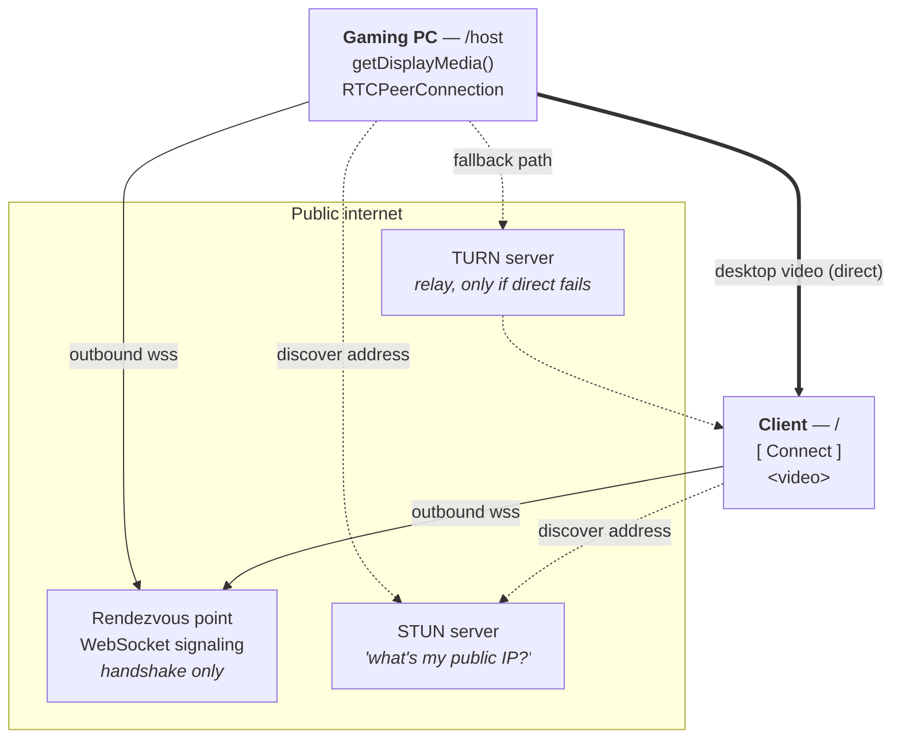
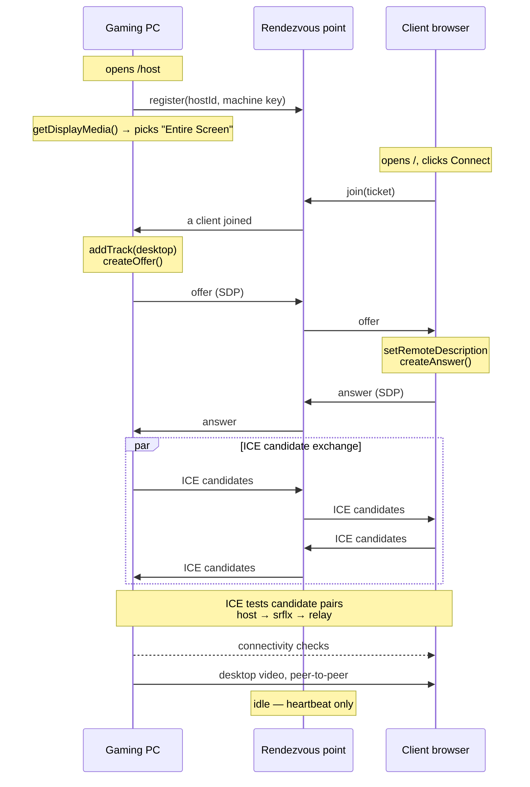

# WebRTC desktop streaming — architecture

How a Windows gaming PC streams its desktop to another person's browser over the public internet, and why the pieces are arranged the way they are.

Status: **design only.** No implementation exists yet.

---

## The problem WebRTC actually solves

Two browsers cannot find each other on the internet. Both sit behind home routers doing NAT (Network Address Translation): the PC believes its address is something like `192.168.1.50`, while the outside world only ever sees the router's public address. Nothing outside can dial in.

This creates a chicken-and-egg problem. To open a direct connection, each side needs the other's reachable address — but they have no channel to exchange one. **WebRTC deliberately does not solve this.** It gives you the machinery to hold a peer-to-peer call, and leaves finding the peer to you.

That gap is filled by two separate things people constantly conflate:

| | What it does | Does video pass through it? |
|---|---|---|
| **Rendezvous point** (signaling server) | Introduces the two machines to each other | No |
| **ICE servers** (STUN / TURN) | Work out which network path can actually carry the connection | STUN: no. TURN: yes |

A consequence worth stating plainly, because it is the most common wrong mental model: **you cannot connect to a gaming PC by hardcoding its IP address.** That machine has no stable, dialable address from the outside. Everything below follows from that.

---

## The rendezvous point

A small server both machines can reach. Its only job is to pass messages between them before the real connection exists.

**Why it must be public, and why it can't live on the gaming PC:** NAT permits outbound connections and blocks inbound ones. If the rendezvous point ran on the gaming PC, the client couldn't reach it — the same problem all over again. So it sits somewhere publicly reachable and *both* machines dial *out* to it. Outbound works from behind any router.

It relays exactly three kinds of message:

- **Offer** — "here's what I can send: this video codec, these parameters"
- **Answer** — "understood, here's what I can receive"
- **ICE candidates** — "here are network addresses you might reach me at"

It never inspects them. It is a dumb pipe that knows which two sockets are in a room together.

**The key property:** once the peer connection is established, the video does **not** flow through it. It goes machine-to-machine. The rendezvous point sits idle.

It is a mutual friend who gives you each other's phone number — after that you call directly, and the friend isn't on the line.

---

## ICE servers: STUN and TURN

**ICE** (Interactive Connectivity Establishment) is the algorithm that finds a working path between two peers. It gathers every address a peer might be reachable at — a *candidate* — then tests pairs until one works.

Three candidate types, cheapest first:

| Type | Meaning | How it's found |
|---|---|---|
| `host` | The machine's own local address (`192.168.1.50`) | Read off the network interface. Free. Only works if both peers are on the same network. |
| `srflx` | "Server-reflexive" — the public address the world sees | Asked a **STUN** server |
| `relay` | An address on a relay server that forwards traffic | Allocated on a **TURN** server |

### STUN — "what's my public address?"

Your PC genuinely does not know its own public address. A **STUN** server answers one question: it receives a packet and replies *"I saw that arrive from `203.0.113.5:54321`."*

That's the whole protocol. The peer then tries to connect to that address directly. STUN is tiny, stateless, and free to run — **no video ever passes through it.** It is a mirror, not a pipe.

### TURN — the fallback relay

Sometimes a direct connection is impossible. The common culprit is *symmetric NAT*, where the router assigns a different external port for every destination, so the address STUN reported is useless to anyone else. Carrier-grade NAT — increasingly standard on home fibre and universal on mobile data — behaves this way.

When that happens, **TURN** relays the actual media. Both peers connect outbound to the TURN server and it forwards packets between them.

This always works, and it is expensive, because **all the video flows through it.** A desktop stream at 10 Mbps is roughly **4.5 GB/hour**. Around **20% of residential connections** need a relay, and a gaming session is measured in hours rather than minutes — so relayed traffic is a disproportionate share of total bandwidth.

Provider choice is roughly a 30× cost swing:

| Option | Cost | Notes |
|---|---|---|
| Self-hosted coturn on a VPS | ~€5/mo, egress included | Cheapest at volume; real infrastructure to run |
| Cloudflare Realtime TURN | ~$0.05/GB | Cheapest managed option |
| Twilio / Xirsys | ~$0.40/GB | ~$1.80/hour per relayed session — does not survive contact with a gaming workload |

Worth deciding before pricing the product.

### How they're configured

```ts
const ICE_SERVERS = [
  { urls: "stun:stun.l.google.com:19302" },              // ask "what's my public IP?"
  { urls: "turn:...", username: "...", credential: "" }, // relay, if direct fails
];
```

ICE tries them in cost order and picks the first path that works. You don't choose — you supply options and ICE decides.

---

## Topology



Thick line = video. Dotted = setup and fallback. The rendezvous point is never on the video path.

---

## The connection flow



---

## Reading the connection state

`getStats()` reports which candidate type won. The client surfaces it, because it is the difference between "it works" and "it works for the reason I think":

- **`host`** — same local network. Says nothing about whether the internet path works.
- **`srflx`** — direct across the internet via STUN. This is the good case.
- **`relay`** — going through TURN. Working, but costing bandwidth.

---

# Intended implementation

Design settled; not built yet.

## Shape

One Node process serves the React app *and* the signaling WebSocket. `cloudflared` exposes it publicly. Both machines load the same HTTPS origin — the gaming PC at `/host`, the client at `/`. Same origin means the signaling URL is just `window.location`: nothing to hardcode, no mixed-content problem, and both pages sit in a secure context.

## Components

### `server/index.js` — Node + `ws`

Static files plus a signaling relay. In-memory room map, no database.

| Message | Direction | Effect |
|---|---|---|
| `{type:"register", hostId, key}` | host → server | claims a room, if the machine key matches |
| `{type:"join", ticket}` | client → server | joins the ticket's room, notifies host |
| `{type:"denied", reason}` | server → either | refused; the socket is closed |
| `{type:"offer"\|"answer"\|"ice"}` | either → server | relayed to the peer |
| `{type:"ping"}` | both, every 25s | **required** — see below |

**The heartbeat is not optional.** Cloudflare closes an idle WebSocket after 100 seconds. A host waiting for a connection would silently drop off. Both sides ping every 25s and reconnect with backoff.

The host creates the offer, because the host owns the media track.

### `web/src/Host.tsx`

Registers as `HOST_ID`, captures, answers join requests. Three things must be explicit — each fails silently otherwise:

```ts
// Chrome IGNORES width/height/frameRate passed INTO getDisplayMedia.
// A 4K monitor hands back a raw 4K track. Downscale afterwards:
await track.applyConstraints({ width: 1920, frameRate: 60 });

track.contentHint = "motion";

const p = sender.getParameters();
p.degradationPreference = "maintain-resolution";  // else Chrome drops to 320x180 under load
p.encodings[0].maxBitrate = 10_000_000;           // else bandwidth estimation saturates the link
await sender.setParameters(p);
```

### `web/src/Client.tsx`

Connect → WebSocket → join → answer → attach stream. Sets `receiver.jitterBufferTarget = 0` (largest single latency win). Status line shows `connectionState` and the selected candidate type.

## The file you edit — `web/src/config.ts`

```ts
export const SIGNALING_URL = `wss://${window.location.host}`;  // same origin, nothing to edit
export const HOST_ID       = "gaming-pc-1";                    // ← which machine to reach

export const ICE_SERVERS: RTCIceServer[] = [
  { urls: "stun:stun.l.google.com:19302" },
  // { urls: "turn:HOST:3478", username: "USER", credential: "PASS" },
];

export const FORCE_RELAY = false;                              // ← prove the internet path
```

## Stack

Vite + React + TypeScript (routes `/` and `/host`), Node + `ws`, `cloudflared`. No database, no auth.

## Verification

**Stage 1 — two tabs, one machine.** Signaling and the offer/answer exchange.

**Stage 2 — across the LAN.** Real capture, real media. Status line reads `host`.

**Stage 3 — prove the internet path.** The acceptance criterion, and the stage most likely to be skipped. If both test machines share a LAN, ICE picks host candidates and connects locally — **it will work while proving nothing.**

- **Mobile hotspot.** Tether the client to a phone. Carrier CGNAT is symmetric NAT — genuinely different network, five minutes. Status line should read `srflx`.
- **`FORCE_RELAY = true`** on both peers with a `getStats()` assertion that both candidates are type `relay`. Needs TURN credentials.

## The host application

The gaming PC runs an **installed app**, not a browser tab. This is the intended end state, and it exists to solve two things a web page fundamentally cannot.

**1. The screen-picker.** In a browser, `getDisplayMedia` permission is non-persistable and requires a fresh user gesture on every call. A human would have to be at the gaming PC clicking "Share" for every single session, and again after any reboot or crash — which defeats the entire premise of renting out an idle machine.

Electron removes this. `session.setDisplayMediaRequestHandler()` answers the picker programmatically:

```js
session.defaultSession.setDisplayMediaRequestHandler((request, callback) => {
  desktopCapturer.getSources({ types: ["screen"] }).then(sources => {
    callback({ video: sources[0] });   // no dialog, no human
  });
});
```

The app then auto-launches at Windows boot and registers itself as available. No one touches the gaming PC.

**2. Input injection.** A browser tab cannot move the mouse or press keys on Windows — no web API exists for it, by design. Remote *control* (as opposed to remote *viewing*) requires a native process. That is the same app.

**The prototype is not wasted work.** Signaling, ICE, the offer/answer exchange, TURN and the encoder parameters are identical in both — Electron runs the same Chromium and the same WebRTC stack. Going native replaces one function call (how the capture track is acquired) and adds a DataChannel handler for input. It is not a rewrite, which is why proving the connection in a plain browser first is the cheaper order.

## Deferred

- **TURN credentials.** Adding them is a one-line config change. Until then roughly 1 in 5 real users won't connect, and the mobile-hotspot test may itself fail — CGNAT is exactly what TURN exists for. If it fails, that's the finding, not a bug.
- **Input control.** Needs the native host above, plus a DataChannel carrying mouse/keyboard events. Out of scope until viewing works end to end.
