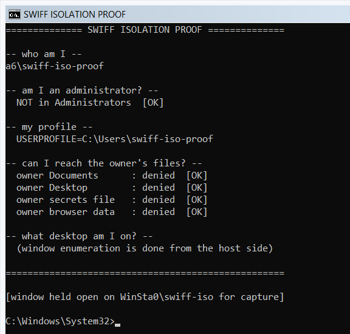
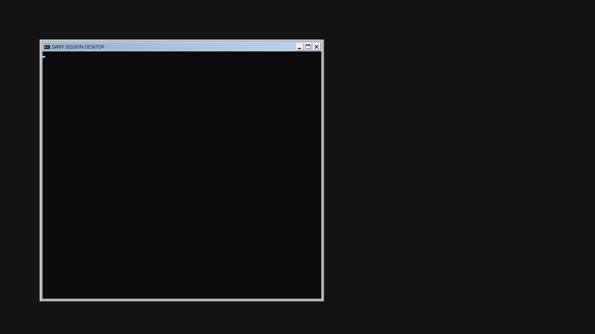

# Isolation proof

The host design rests on one claim that had never been tested on real hardware
([`docs/system-design/host.md`](../../docs/system-design/host.md), non-functional requirement
*Isolation*):

> The system runs the session in a separate Windows account and wipes it afterwards.

This prototype proves each half of that on this machine, then removes everything it made.

```powershell
# elevated - account creation needs administrator
powershell -NoProfile -ExecutionPolicy Bypass -File .\Prove-Isolation.ps1
```

- `Win32Iso.cs` - the Win32 surface: `CreateDesktop`, window-station/desktop DACLs,
  `CreateProcessWithLogonW` onto a named desktop, `EnumDesktopWindows`, and two capture paths.
- `Prove-Isolation.ps1` - the run: creates, asserts, captures, and tears down in a `finally`.
- `out/` - artifacts from the last run (captures, probe output, `report.json`). Not source.

## Result, run 2026-09-30 on A6, Windows 11 Pro 26100

All ten assertions passed.

| Claim | How it was shown |
|---|---|
| A standard account can be created | `New-LocalUser`, SID `…-1002`, groups: `Users` only |
| It is not an administrator | not a member of `S-1-5-32-544`, confirmed from inside by `whoami /groups` |
| A process runs inside that account | `Win32_Process.GetOwner` → `A6\swiff-iso-proof` for both pids |
| …on its own desktop | launched with `lpDesktop = WinSta0\swiff-iso` |
| The desktops are disjoint | isolated desktop: 6 windows / 4 procs; owner desktop: 145 windows / 37 procs; **process overlap: 0** |
| The renter is invisible to the owner | 0 renter pids among the owner desktop's windows |
| The renter cannot reach the owner | owner Documents, Desktop, `.env`, browser data - all denied |
| That desktop can be captured | `PrintWindow(PW_RENDERFULLCONTENT)` → 576×550, 131 distinct colours |
| The account is deleted afterwards | `Get-LocalUser` → not found |
| The profile is deleted with it | no `C:\Users\swiff-iso-proof`, no orphaned `Win32_UserProfile` |



That image was read out of `WinSta0\swiff-iso` by the host process. Nothing it shows was
ever visible on the owner's screen.

## Whole-desktop capture: `Prove-SwitchDesktop.ps1`

The run above could only capture the isolated desktop **per window**. `CreateDC("DISPLAY")` +
`BitBlt` returned a black frame (1 distinct colour), because an *inactive* desktop has no display
surface - Windows gives the display to whichever desktop is switched to. `PrintWindow` worked only
because it asks a window to redraw itself into a DC.

`Prove-SwitchDesktop.ps1` fixes that with `SwitchDesktop()` and then measures what capture it buys.
The screen goes to the session desktop for a few seconds; `Restore-Desktop.ps1` runs detached as a
watchdog and forces it back even if the main script dies.

```powershell
powershell -NoProfile -ExecutionPolicy Bypass -File .\Prove-SwitchDesktop.ps1        # readable pace
powershell -NoProfile -ExecutionPolicy Bypass -File .\Prove-SwitchDesktop.ps1 -Busy  # throughput
```

### Result, same machine, AMD Radeon(TM) Graphics (integrated), 1920x1080 @ 59 Hz

All eight assertions passed, both runs.

| Claim | How it was shown |
|---|---|
| The monitor really switches | `OpenInputDesktop` + `UOI_NAME`: `Default` → `swiff-switch` → `Default` |
| GDI whole-desktop capture now works | 1536x864, 96-100 distinct colours (**was** black / 1 colour when inactive) |
| Desktop Duplication attaches | `IDXGIOutput1::DuplicateOutput` → `S_OK` on the session desktop |
| GPU capture delivers real frames | **246 frames in 5.0 s = 49 fps, 0 timeouts**, native 1920x1080 |
| The owner gets the screen back | `finally` switch-back + watchdog; input desktop `Default` afterwards |
| The account is still wiped | user gone, no `C:\Users` leftovers |



That is a Desktop Duplication frame of the isolated desktop, read back through a staging texture.

Two details worth carrying forward:

- **DDA gives native pixels, GDI gives DPI-scaled ones.** Same screen, same instant: DDA reported
  1920x1080, `GetSystemMetrics` reported 1536x864 (this display runs at 125%). Capture via DDA.
- **`MapDesktopSurface` returns `DXGI_ERROR_UNSUPPORTED`** here, so the frame has to be copied to a
  staging texture to reach the CPU. That only matters for this proof - a real encoder takes the
  GPU texture directly and never reads it back.

## What is still unproven, and it is the important part

**DWM does not composite a secondary desktop.** Look at the capture: classic square window chrome,
no shadows, bare background. The Desktop Window Manager only composites `Default`. Everything below
follows from that, and none of it is settled by these runs:

- Modern games overwhelmingly present **borderless-windowed** through the DWM flip model. Without
  DWM there is no flip chain. Exclusive fullscreen may still work; borderless may not.
- The **Steam client** renders its UI with CEF/Chromium and expects a composited desktop.
- No GPU-accelerated application was actually launched on the secondary desktop here. A console
  window redrawing text is not evidence that Direct3D presents correctly there.

And two isolation gaps that a secondary desktop does not close, because the session is shared:

- **Clipboard is per-window-station, not per-desktop.** `WinSta0` is shared, so the renter and the
  owner share a clipboard. Real leak.
- **Audio endpoints are per-session.** Both accounts live in session 1, so there is one audio
  session - you cannot capture the renter's audio without capturing the owner's.

The fix for all five is the same: give the renter a **real logon session** rather than a second
desktop inside the owner's. The account lifecycle and teardown proven above is unchanged either way.

---

# Options

Four ways to give the renter a screen. The account-creation and wipe half is identical in all of
them; what differs is where the session lives and what the GPU will do for it.

| | Approach | Gets you | Costs |
|---|---|---|---|
| **A** | Secondary desktop in the owner's session | No reboot, no RDP, instant switch, one click | **Ruled out: GPU apps do not render there - see below** |
| **B** | Real session over RDP loopback, then `tscon <id> /dest:console` | Own window station, clipboard, audio and DWM; real GPU; exclusive fullscreen | **Does not work on a client SKU - see below** |
| **C** | Real session via AutoAdminLogon + reboot | Same as B, simplest mechanism | A reboot per session (~40 s); credentials in LSA secrets |
| **D** | Virtual display driver on top of B or C | Headless, renter picks the resolution, owner's panel stays private | Driver signing |

**A is a demo, not a product.** It captures well and it proved the account lifecycle, but the
missing DWM means modern borderless-windowed games and the Steam client are unlikely to render,
and the shared clipboard is a straightforward leak.

**D is not an alternative to B or C.** A virtual monitor attaches to the *console* session's
display topology, and an RDP session cannot enumerate one - so a VDD does not remove the need for
a real session that owns the console. It replaces the *monitor*, not the session.

## A is ruled out too: `Prove-GpuApp.ps1`, tested 2026-09-30

The console window captured at 49 fps, but a console window is not a game. Launching Chromium -
the same engine as the Steam client UI - as the throwaway user on the secondary desktop:

- **7 `msedge` processes started. Zero windows over 200 px on that desktop.**
- The Desktop Duplication capture of that desktop: 2 frames, **1 distinct colour**. Black.

The processes live, they just never present. Without DWM there is no composition target, so the
whole modern presentation path is absent. This was previously an inference; it is now measured.
Option A remains fine for capturing a plain GDI window and nothing else.

## B is ruled out: `Prove-RealSession.ps1`, tested 2026-09-30

The logon half of B does not work on Windows 11 Pro, and the reason is a deliberate product
restriction rather than anything configurable. Screenshotting the modal that `mstsc` raised on the
disconnected desktop gave the exact text:

> **Your computer could not connect to another console session on the remote computer because you
> already have a console session in progress.**

Windows refuses an RDP connection from a machine to itself while a console session exists. The
owner's session being *disconnected* does not help - it still owns the console. There is no client
in the box that skips the check, so the loopback trick cannot create the session.

Everything up to the logon did work and is worth keeping, because it is all reusable by C:

| Verified | Detail |
|---|---|
| Throwaway account, not an administrator | created, added to Remote Desktop Users |
| RDP reachable over loopback only | service on, all three RDP firewall rules left **disabled**; the firewall does not filter loopback |
| Listener readiness is a real race | `Start-Service` returns before RDP-Tcp accepts; the first run connected into that gap |
| Owner console restored every time | `finally` plus a SYSTEM watchdog task; the owner had the console back on all five runs |
| Full revert | account, profile, credential, tasks, startup item, `fDenyTSConnections`, `AuthenticationLevelOverride` |

Four bugs were found and fixed along the way, and the first two are worth remembering because they
are not specific to this script:

1. **`schtasks` warnings are terminating errors.** Under `$ErrorActionPreference = 'Stop'`, a native
   command writing to stderr throws - and `2>&1 | Out-Null` does **not** suppress it. This killed
   the teardown at its first statement and left RDP enabled and the account alive. Every teardown
   block now sets `Continue` and wraps each step.
2. **Buffered output hides where a script actually got to.** `Out-File` had flushed only as far as a
   step that was five minutes stale. `out/progress.txt` is appended and flushed per line instead.
3. Unsigned `.rdp` files raise "Caution: Unknown remote connection", modal, on a screen nobody can
   see. Command-line `mstsc /v:` does not.
4. `Iso.Capture` used an unbounded `Thread.Join()`. `PrintWindow` never returns for a window whose
   owner is blocked, so one bad screenshot wedged the whole run. Bounded to 15 s.

## Recommended stack

```
throwaway standard account          PROVEN     Prove-Isolation.ps1
  -> real logon session             via C, autologon at boot - B is ruled out
  -> it already owns the console    free with C; no tscon, no RDP
  -> GPU capture at native res      PROVEN     Prove-SwitchDesktop.ps1 (49 fps, 0 timeouts)
  -> virtual display for output     untested, needs a signed IDD
  -> SYSTEM service holding it      not yet built
```

With **C** the renter account is auto-logged-on at boot, so it *is* the console session from the
first frame. That removes the session-creation problem, the `tscon` handoff, the RDP exposure and
the "owner already has a console session" block all at once. The cost is a reboot per session -
which for a rental machine is close to a feature, since it guarantees the renter starts from a
clean machine. The password lives in LSA secrets (`LsaStorePrivateData`), not in plain registry.

The **SYSTEM service** is required whatever else is chosen. Sessions come and go; a service in
session 0 is the only thing that survives them. It owns the kill switch, and it spawns the capture
and input agent into whichever session is active via `WTSQueryUserToken` + `CreateProcessAsUser`.
This is how Parsec and Sunshine are built.

The **virtual display driver** solves three product problems at once, which is why it is worth the
signing cost eventually:

- **Privacy.** With the console handoff, whatever the renter plays is on the owner's physical
  monitor, in the owner's room. A VDD renders the game to a virtual output instead, leaving the
  physical panel free to show a "machine rented" screen. Related: the lock and sign-in screen
  background is brandable on Pro via
  `HKLM\SOFTWARE\Policies\Microsoft\Windows\Personalization\LockScreenImage`, with
  `legalnoticecaption` / `legalnoticetext` for a line of text.
- **Headless.** A rental box with no monitor plugged in has no output for the GPU to render to.
- **Resolution.** DDA can duplicate a chosen `IDXGIOutput`, so the renter can be served 1440p144
  from a 1080p60 panel.

The cost is that an indirect display driver must be signed to load without test-signing mode -
WHQL, or licensing someone else's - and that lands directly on the *Trust* requirement in
[`host.md`](../../docs/system-design/host.md) ("ships as a signed installer"). **Interim:** an HDMI
dummy plug forces an output to exist with no driver and no signing. It fixes headless, not privacy,
and the resolution is pinned by EDID - fine for validating the architecture, not for shipping.

## What B changes on the machine, and puts back

`Prove-RealSession.ps1` reverts all of this in its `finally` block, and asserts the revert:

- `fDenyTSConnections` 1 -> 0, and back. The three RDP firewall rules stay **disabled** throughout;
  Windows Firewall does not filter loopback, so only 127.0.0.1 can reach the listener.
- `TermService` start type, if it had to change.
- A saved `TERMSRV/localhost` credential, two scheduled tasks, one local account and its profile.

A SYSTEM watchdog task restores the owner's console after `-WatchdogMinutes` even if the script is
killed outright. The owner's session is *disconnected*, not logged off, so reconnecting shows the
lock screen and asks for the Windows password once.

## Footprint

Everything is torn down in a `finally`, including on failure: processes killed, desktop closed,
the two ACEs added to `WinSta0` removed, `C:\Users\Public\swiff-iso-proof` deleted, profile and
account removed. Verified afterwards from a separate shell: account gone, `C:\Users` back to
`Public, tomsc`, no orphaned profile records.
