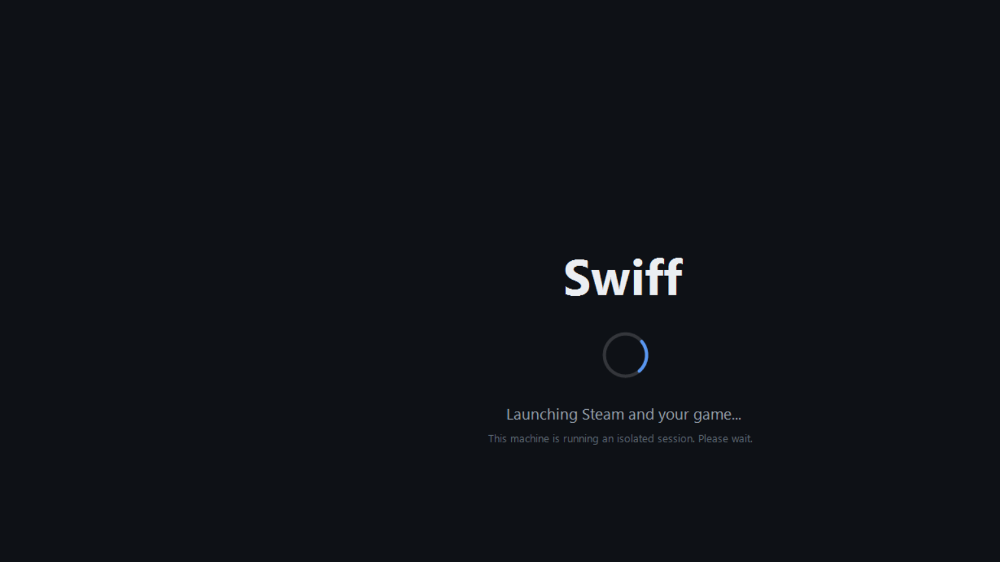

# Session splash

A borderless, top-most, full-screen cover shown the instant the renter's session starts, so the
renter never sees the bare desktop, the logon spinner, or Steam launching - only Swiff branding and
a status line, until the stream is live.

It answers the "can we replace the Windows 'getting everything ready' text?" question: you can't
rewrite the OS text (unsupported, and it no longer appears on reused logins anyway), so instead we
*cover* the whole startup with our own screen that we fully control.



## What it does

- Fills the primary display, dark, top-most, no cursor, no taskbar. Reasserts top-most if it loses
  foreground, so nothing pops in front of it.
- Shows the wordmark, an animated spinner, and a subtitle.
- **`status.txt`** - the host agent writes a line here and it becomes the subtitle live
  ("Downloading your saves...", "Launching Steam and your game..."). Proven working.
- **`ready.flag`** - the host agent creates this when the WebRTC stream is connected; the splash
  fades out and exits. Proven working (it dismissed itself on the flag in testing).
- 120 s timeout so a stuck session never traps the screen; `--dev` enables Esc to close.

Signal files live in `C:\ProgramData\Swiff\session\`.

## Build

```
csc /target:winexe /out:build\SwiffSplash.exe /reference:System.Windows.Forms.dll /reference:System.Drawing.dll Splash.cs
```

A 9 KB exe, no dependencies, launches in well under a second.

## Wiring into the session (later)

- Launch from the renter profile's Startup, or from the host session-agent, as the very first thing.
- The host agent drives `status.txt` through the startup steps and writes `ready.flag` when the
  stream connects.
- Production hardening not done here: cover **all** monitors (one form per screen), block input
  underneath until ready, and sign the exe.

## Status

Built and demonstrated on hardware 2026-09-30: renders correctly, updates its subtitle from
`status.txt`, and dismisses itself on `ready.flag`.
